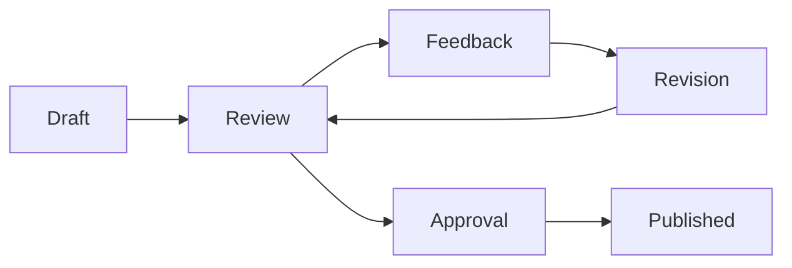

# Collaborative Editing

Documentation.AI transforms team documentation workflows with intelligent collaboration features. Our platform combines real-time editing, AI-powered assistance, and smart conflict resolution to help teams create better documentation together.

## Real-Time Collaboration

### Live Editing

Work together on documentation in real-time:

- **Simultaneous Editing**: Multiple team members can edit the same document
- **Live Cursors**: See where teammates are working in real-time
- **Instant Sync**: Changes appear immediately across all connected devices
- **Conflict Prevention**: Smart locking prevents editing conflicts

### Collaborative AI

AI assistance that works for the entire team:

- **Shared Context**: AI learns from all team members' contributions
- **Consistent Voice**: Maintains unified tone across different authors
- **Knowledge Sharing**: AI suggests relevant content from teammates' work
- **Quality Assurance**: Ensures consistency across collaborative content

## Team Management

### Role-Based Permissions

Control who can do what in your documentation:

**Editor Roles:**
- **Owner**: Full administrative access and billing control
- **Admin**: Manage team members and project settings
- **Editor**: Create, edit, and publish content
- **Reviewer**: Comment and suggest changes
- **Viewer**: Read-only access to documentation

**Granular Permissions:**
- Page-level access control
- Section-specific editing rights
- Comment and suggestion permissions
- Publishing and deployment controls

### Team Workflows

Structured processes for collaborative documentation:



**Workflow Features:**
- **Draft Mode**: Work privately before sharing
- **Review Requests**: Assign specific reviewers
- **Approval Process**: Require sign-off before publishing
- **Version Control**: Track changes and maintain history

## Smart Collaboration Features

### Intelligent Suggestions

AI helps coordinate team efforts:

- **Content Gaps**: Identifies missing information that teammates should add
- **Duplicate Detection**: Prevents redundant work across team members
- **Style Consistency**: Suggests edits to match team writing standards
- **Cross-References**: Recommends links to teammates' relevant content

### Conflict Resolution

Automatically handle editing conflicts:

- **Smart Merging**: AI resolves non-conflicting simultaneous edits
- **Conflict Highlighting**: Clearly shows conflicting changes
- **Resolution Suggestions**: AI proposes merge solutions
- **Version Comparison**: Side-by-side view of conflicting versions

### Collaborative AI Training

Team knowledge improves AI for everyone:

- **Collective Learning**: AI learns from all team members' expertise
- **Shared Vocabulary**: Builds team-specific terminology database
- **Best Practices**: Identifies and promotes successful patterns
- **Quality Patterns**: Learns from team's editing and approval patterns

## Communication Tools

### Contextual Comments

Discuss specific content without cluttering the document:

- **Inline Comments**: Add comments to specific text selections
- **Thread Discussions**: Maintain conversation context
- **Resolution Tracking**: Mark comments as resolved when addressed
- **Notification System**: Stay updated on relevant discussions

### Suggestion Mode

Propose changes without directly editing:

- **Track Changes**: Similar to Google Docs suggestion mode
- **Batch Approval**: Accept or reject multiple suggestions at once
- **Suggestion History**: Review all proposed changes over time
- **AI-Enhanced Suggestions**: AI can propose improvements for review

### Team Chat Integration

Connect with popular communication tools:

- **Slack Integration**: Get notifications and updates in Slack channels
- **Microsoft Teams**: Sync with Teams conversations and notifications
- **Discord**: Connect with developer community discussions
- **Custom Webhooks**: Integrate with any communication platform

## Project Organization

### Multi-Project Management

Organize documentation across multiple projects:

- **Project Templates**: Standardize structure across projects
- **Cross-Project References**: Link between related documentation
- **Shared Resources**: Reuse components and content across projects
- **Unified Search**: Find content across all team projects

### Branch-Based Collaboration

Work on different versions simultaneously:

- **Feature Branches**: Develop documentation for new features
- **Version Branches**: Maintain docs for different product versions
- **Merge Requests**: Review changes before merging to main branch
- **Branch Comparison**: See differences between documentation versions

### Content Libraries

Share reusable content across the team:

- **Component Library**: Shared UI components and templates
- **Content Snippets**: Reusable text blocks and explanations
- **Style Guide**: Centralized writing and formatting standards
- **Asset Management**: Shared images, videos, and other media

## Advanced Collaboration

### AI-Powered Review

Intelligent assistance for the review process:

- **Automated Checks**: AI reviews for common issues before human review
- **Reviewer Assignment**: AI suggests best reviewers based on expertise
- **Review Prioritization**: Identify which changes need immediate attention
- **Quality Scoring**: AI rates content quality to guide review focus

### Collaborative Analytics

Understand team productivity and content performance:

- **Contribution Tracking**: See who's contributing what content
- **Collaboration Patterns**: Identify effective team workflows
- **Content Performance**: Track how collaborative content performs
- **Team Insights**: Analytics on team productivity and engagement

### Integration Workflows

Connect collaborative editing with development workflows:

```yaml
# Example: Automated documentation updates
name: Sync Documentation
on:
  pull_request:
    types: [opened, synchronize]
jobs:
  update-docs:
    runs-on: ubuntu-latest
    steps:
      - name: Extract API Changes
        run: docai extract-changes --pr ${{ github.event.number }}
      - name: Generate Documentation Updates
        run: docai generate --changes ./api-changes.json
      - name: Create Documentation PR
        run: docai create-pr --target documentation-repo
```

## Best Practices for Team Collaboration

### Establish Clear Guidelines

Set expectations for collaborative work:

- **Writing Standards**: Define tone, style, and formatting rules
- **Review Process**: Establish clear review and approval workflows
- **Responsibility Matrix**: Define who owns what content areas
- **Communication Protocols**: Set expectations for feedback and discussions

### Optimize Team Workflows

Structure collaboration for maximum efficiency:

1. **Planning Phase**: Define content strategy and assign ownership
2. **Drafting Phase**: Create initial content with AI assistance
3. **Review Phase**: Structured peer review and feedback
4. **Refinement Phase**: Incorporate feedback and polish content
5. **Publishing Phase**: Final approval and publication

### Leverage AI Effectively

Use AI to enhance rather than replace human collaboration:

- **Content Generation**: Use AI for first drafts, humans for refinement
- **Consistency Checking**: Let AI catch style and formatting issues
- **Knowledge Synthesis**: AI helps combine insights from multiple contributors
- **Quality Assurance**: AI provides initial quality checks before human review

### Maintain Content Quality

Ensure collaborative content meets high standards:

- **Regular Audits**: Periodic review of collaborative content quality
- **Feedback Loops**: Collect user feedback on team-created content
- **Continuous Improvement**: Refine processes based on outcomes
- **Training and Onboarding**: Help new team members understand workflows

## Security and Privacy

### Access Control

Protect sensitive documentation:

- **Single Sign-On (SSO)**: Integrate with enterprise identity providers
- **Multi-Factor Authentication**: Additional security for sensitive projects
- **IP Restrictions**: Limit access to specific networks or locations
- **Session Management**: Control session duration and concurrent access

### Data Protection

Keep collaborative work secure:

- **Encryption**: All data encrypted in transit and at rest
- **Audit Trails**: Complete history of who accessed and changed what
- **Data Residency**: Choose where collaborative data is stored
- **Backup and Recovery**: Protect against data loss during collaboration

### Compliance

Meet enterprise security requirements:

- **SOC 2 Type II**: Comprehensive security and availability controls
- **GDPR Compliance**: European data protection regulation adherence
- **HIPAA Support**: Healthcare industry compliance features
- **Custom Compliance**: Work with us to meet specific regulatory needs

<Callout kind="success">
Ready to start collaborating? Invite your team members and experience the power of AI-enhanced collaborative documentation.
</Callout>

## Getting Started with Team Collaboration

### Set Up Your Team

1. **Invite Members**: Add team members with appropriate roles
2. **Configure Permissions**: Set up access controls for your content
3. **Establish Workflows**: Define your team's collaboration process
4. **Enable Integrations**: Connect with your existing tools and workflows

### Best Practices for New Teams

- **Start Small**: Begin with a single project to learn the workflow
- **Define Standards**: Establish style and process guidelines early
- **Use Templates**: Create consistent starting points for new content
- **Regular Check-ins**: Schedule team reviews of collaborative processes

The future of documentation is collaborative, intelligent, and seamless. Join thousands of teams already creating better documentation together with Documentation.AI.
