## Overview

Create interactive diagrams using Mermaid syntax. Diagrams automatically adapt to your documentation theme and include zoom controls, fullscreen viewing, and copy functionality.

Common use cases:
- Flowcharts and process diagrams
- Sequence diagrams for API interactions
- Class and entity relationship diagrams
- State machines and user journeys
- Architecture and system diagrams

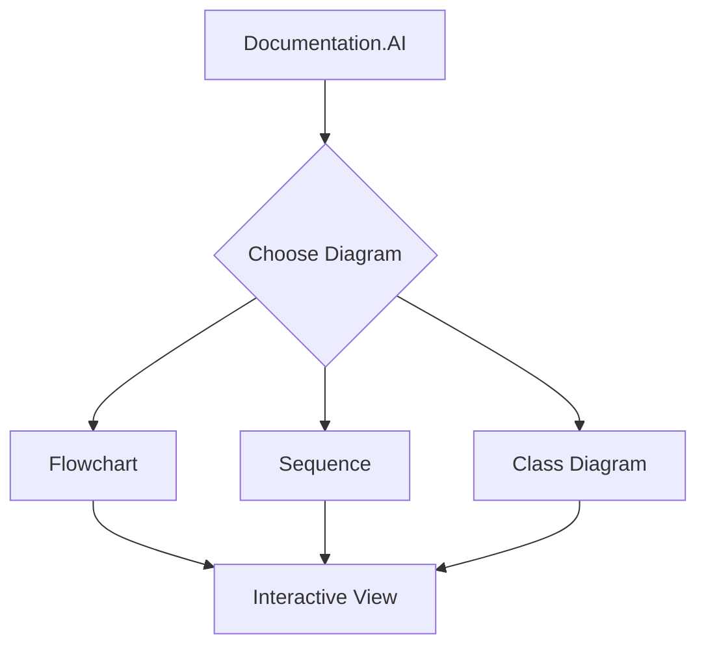

## Basic syntax

Use fenced code blocks with the `mermaid` language identifier to create diagrams:

````markdown
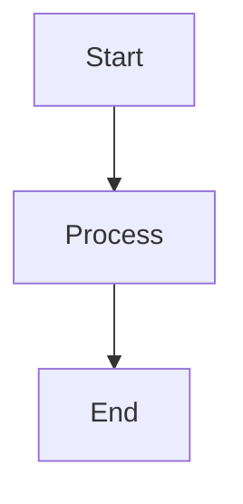
````

## Flowcharts

Create process flows and decision trees with various node shapes and connections:

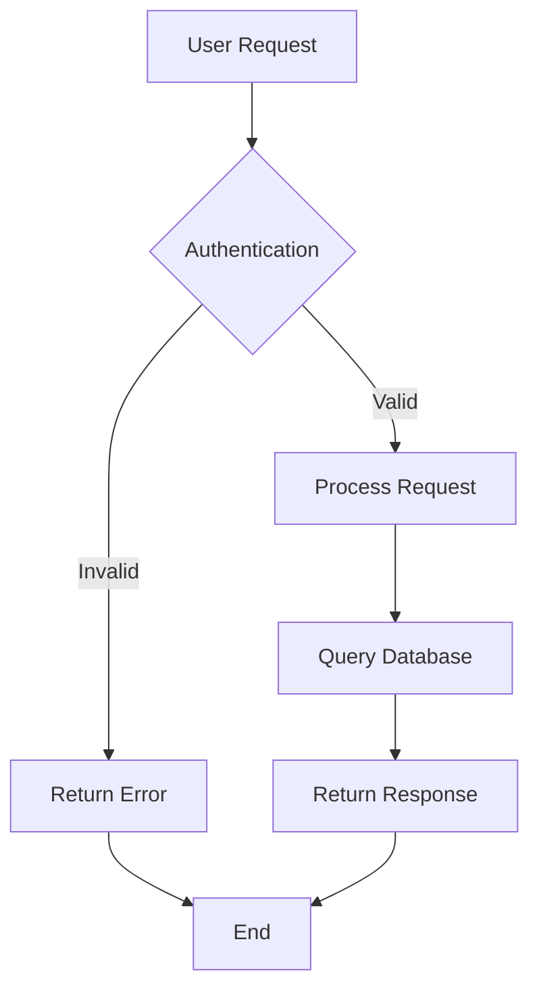

````markdown

````

### Node shapes

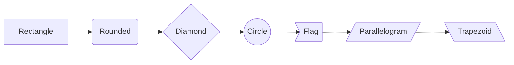

````markdown
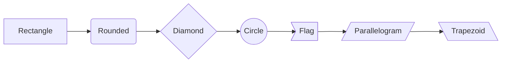
````

## Sequence diagrams

Document API interactions, user flows, and system communications:

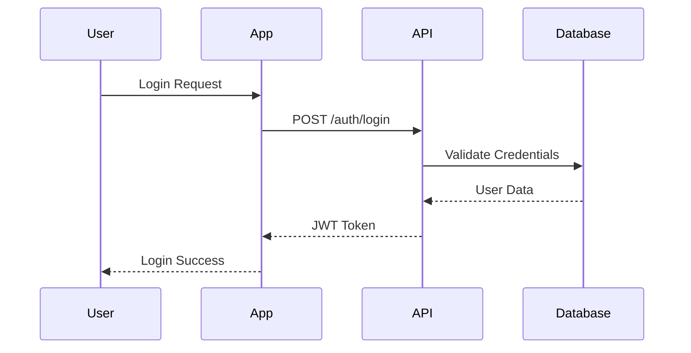

````markdown

````

### Advanced sequence features

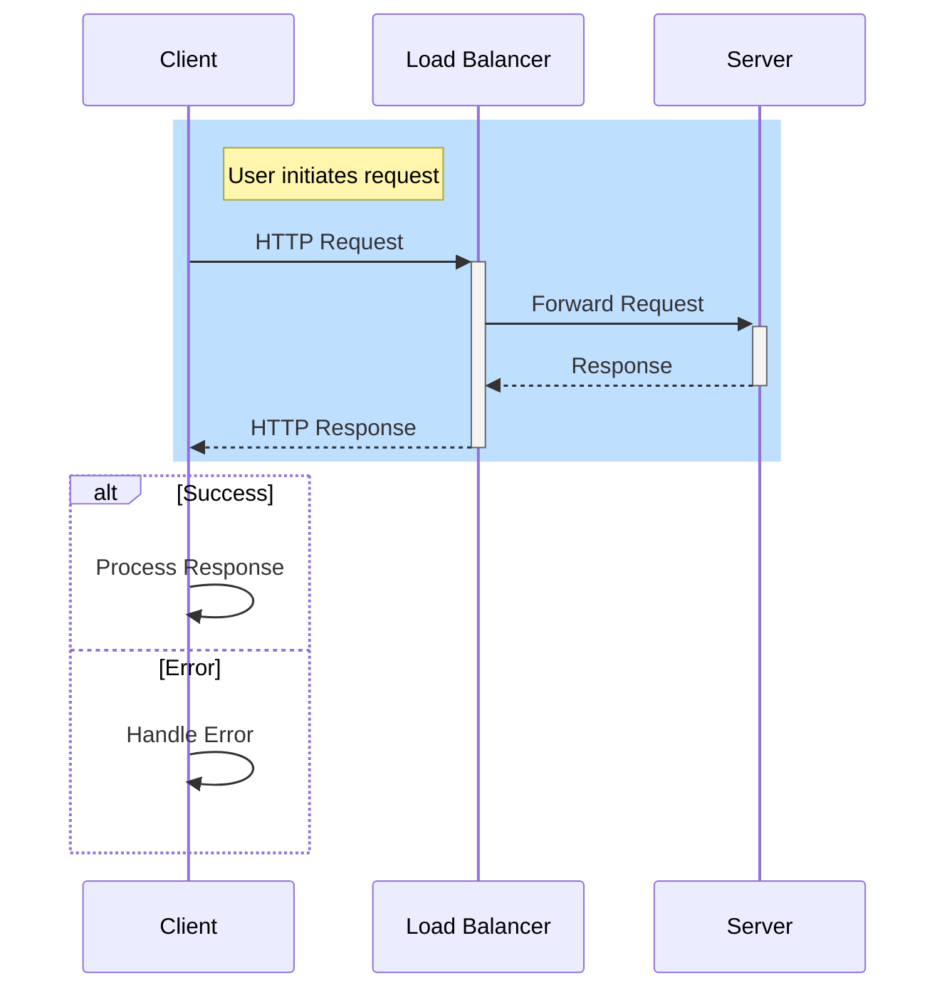

````markdown

````

## Class diagrams

Model data structures, relationships, and system architecture:

```mermaid
classDiagram
    class User {
        +String name
        +String email
        +String id
        +login()
        +logout()
    }
    
    class Documentation {
        +String title
        +String content
        +User author
        +publish()
        +update()
    }
    
    class Project {
        +String name
        +User[] members
        +Documentation[] docs
        +addMember(User)
        +createDoc()
    }
    
    User ||--o{ Documentation : creates
    Project ||--o{ Documentation : contains
    Project ||--o{ User : has
```

````markdown
```mermaid
classDiagram
    class User {
        +String name
        +String email
        +String id
        +login()
        +logout()
    }
    
    class Documentation {
        +String title
        +String content
        +User author
        +publish()
        +update()
    }
    
    User ||--o{ Documentation : creates
```
````

## State diagrams

Illustrate system states and transitions:

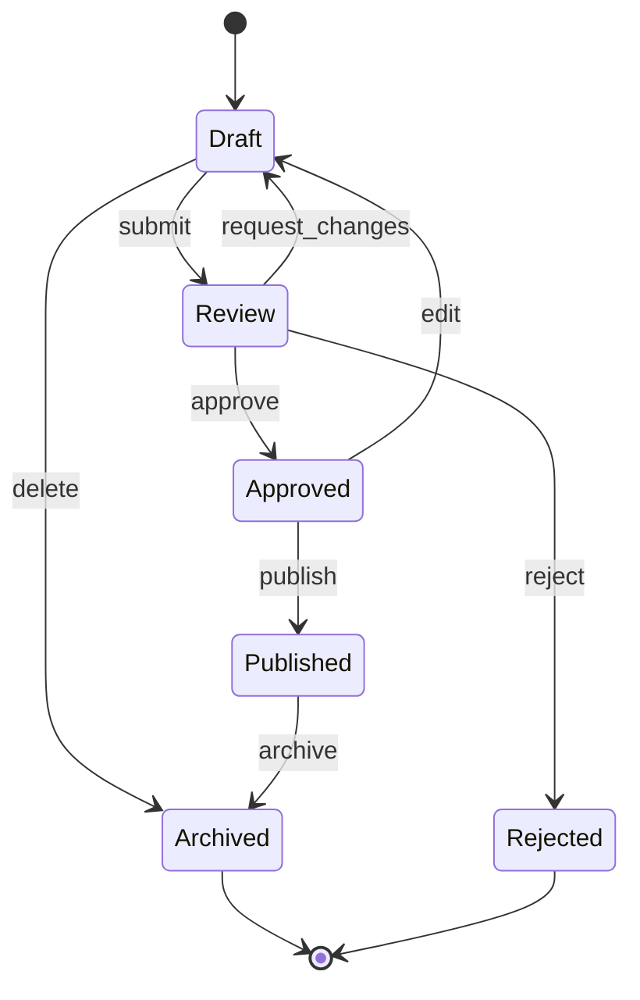

````markdown
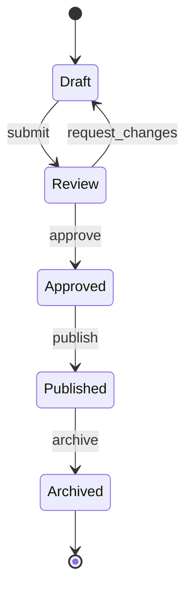
````

## Entity relationship diagrams

Design database schemas and data relationships:

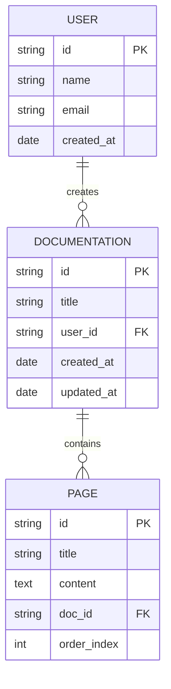

````markdown
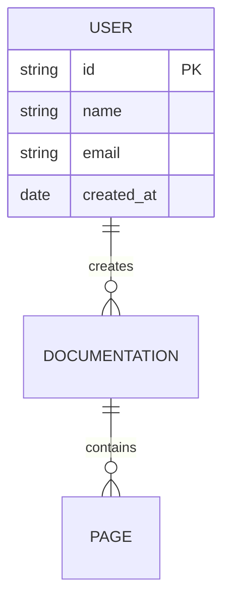
````

## Gantt charts

Project timelines and task scheduling:

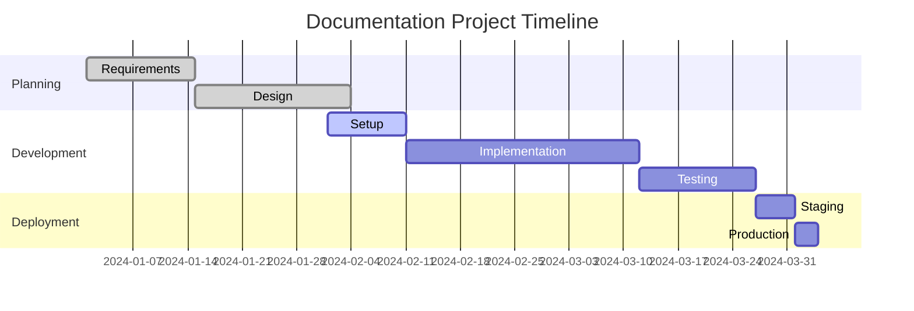

````markdown
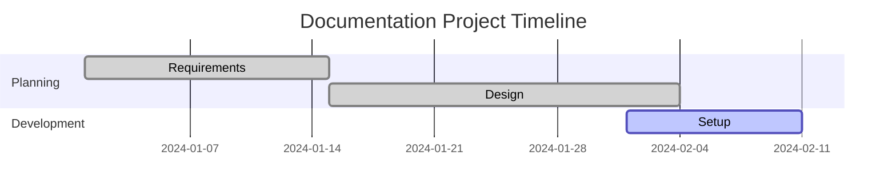
````

## Git graphs

Visualize git workflows and branching strategies:

```mermaid
gitgraph
    commit id: "Initial commit"
    branch develop
    checkout develop
    commit id: "Add user auth"
    commit id: "Add documentation"
    checkout main
    branch feature/api
    checkout feature/api
    commit id: "API endpoints"
    commit id: "Add validation"
    checkout develop
    merge feature/api
    commit id: "Integration tests"
    checkout main
    merge develop
    commit id: "Release v1.0"
```

````markdown
```mermaid
gitgraph
    commit id: "Initial commit"
    branch develop
    checkout develop
    commit id: "Add user auth"
    checkout main
    merge develop
    commit id: "Release v1.0"
```
````

## User journey

Map user interactions and experiences:

```mermaid
journey
    title User Documentation Journey
    section Discovery
      Search for docs     : 3: User
      Find relevant page  : 4: User
    section Reading
      Read content        : 5: User
      Follow links        : 4: User
      Copy code examples  : 5: User
    section Implementation
      Test examples       : 3: User, Developer
      Implement solution  : 5: Developer
      Verify results      : 4: Developer
    section Feedback
      Rate helpfulness    : 4: User
      Report issues       : 3: User
```

````markdown
```mermaid
journey
    title User Documentation Journey
    section Discovery
      Search for docs     : 3: User
      Find relevant page  : 4: User
    section Reading
      Read content        : 5: User
```
````

## Interactive features

### Zoom controls
All diagrams include zoom controls in the top-right corner:
- **Zoom In** (+) - Increase diagram size up to 300%
- **Zoom Out** (-) - Decrease diagram size down to 50%
- **Fullscreen** (⛶) - View diagram in fullscreen mode

### Theme adaptation
Diagrams automatically adapt to your documentation theme:
- **Light mode** - Clean, professional appearance
- **Dark mode** - High contrast with appropriate colors

### Copy functionality
Click any diagram to copy the Mermaid source code to your clipboard for reuse.

## Supported diagram types

**Core diagrams:**  
`flowchart`, `sequenceDiagram`, `classDiagram`, `stateDiagram`, `erDiagram`

**Planning & tracking:**  
`gantt`, `journey`, `timeline`, `gitgraph`

**Data visualization:**  
`pie`, `quadrantChart`, `xyChart`, `sankey`

**Specialized:**  
`mindmap`, `requirement`, `c4Context`, `architecture`, `block`

Visit the [Mermaid documentation](https://mermaid.js.org/intro/getting-started.html) for complete syntax reference and advanced features.

## Attributes

<ParamField path="chart" param-type="string" required="true" showLocation="false">
  Mermaid diagram syntax. Automatically extracted from code blocks with `language-mermaid` class.
</ParamField>

<ParamField path="id" param-type="string" required="false" showLocation="false">
  Unique identifier for the diagram. Auto-generated if not provided.
</ParamField>

## Common patterns

- **API documentation** - Sequence diagrams for request/response flows
- **Architecture docs** - Flowcharts for system overviews and data flow
- **Database design** - ER diagrams for schema documentation
- **Process guides** - Flowcharts with decision points and user paths
- **Project planning** - Gantt charts for timeline visualization
- **State management** - State diagrams for application logic
- **Git workflows** - Git graphs for branching strategies
- **User experience** - Journey diagrams for user interaction mapping
