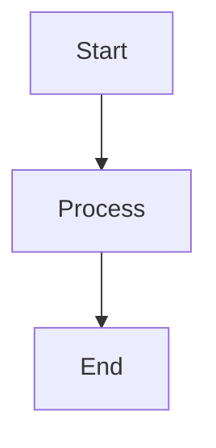
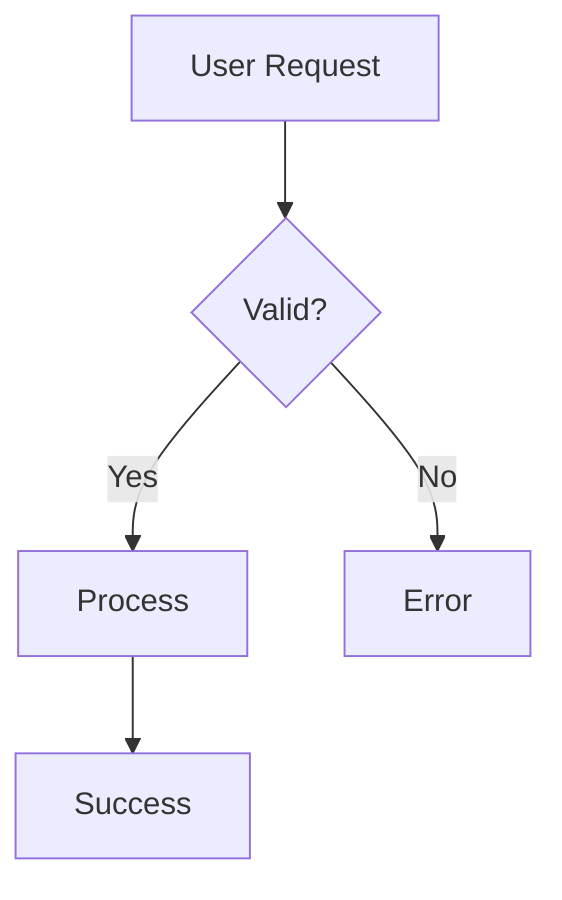
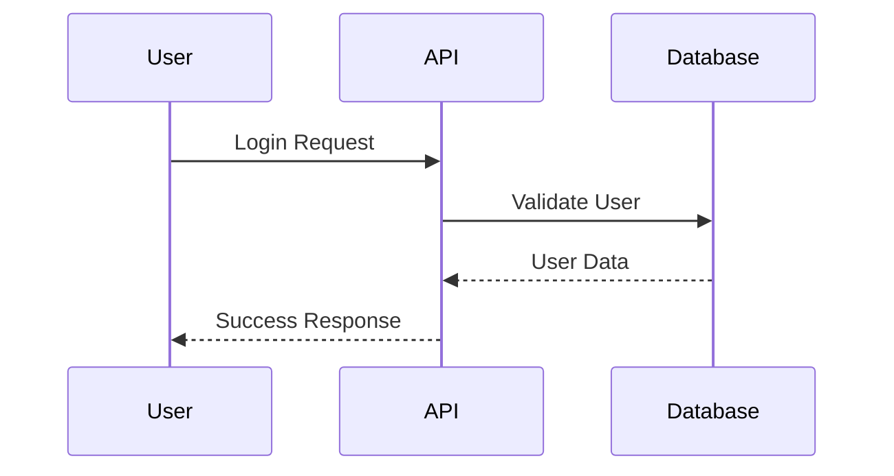
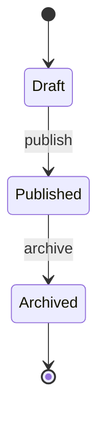

## Overview

Create interactive diagrams using [Mermaid](https://mermaid.js.org/) syntax. Diagrams automatically adapt to your documentation theme and include zoom controls and fullscreen viewing.

For complete syntax reference and all diagram types, visit the [official Mermaid documentation](https://mermaid.js.org/intro/getting-started.html).

## Basic syntax

Use fenced code blocks with the `mermaid` language identifier:

````markdown

````

## Examples

### Flowchart



````markdown

````

### Sequence Diagram



````markdown

````

### State Diagram



````markdown

````

## Features

- **Zoom controls** - Zoom in/out and fullscreen viewing
- **Theme adaptation** - Automatically matches light/dark mode
- **Interactive** - Click to copy source code
