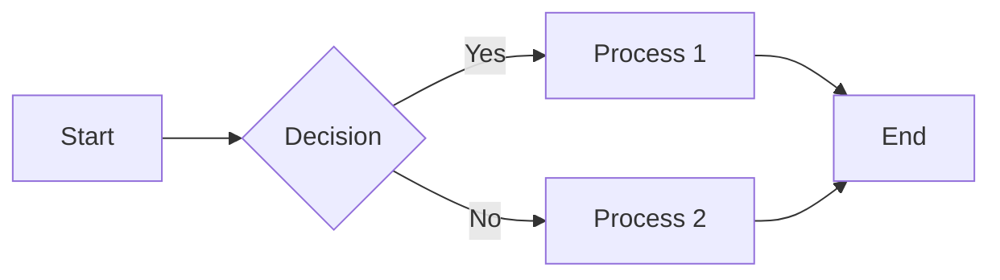
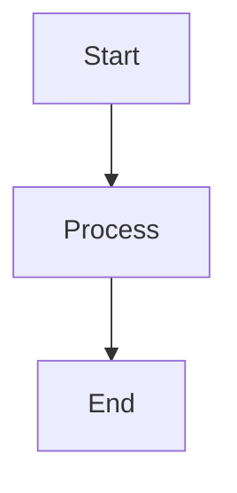
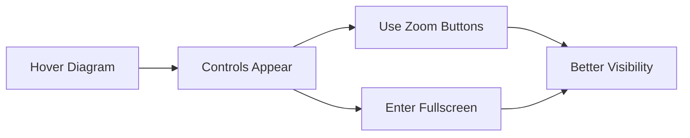
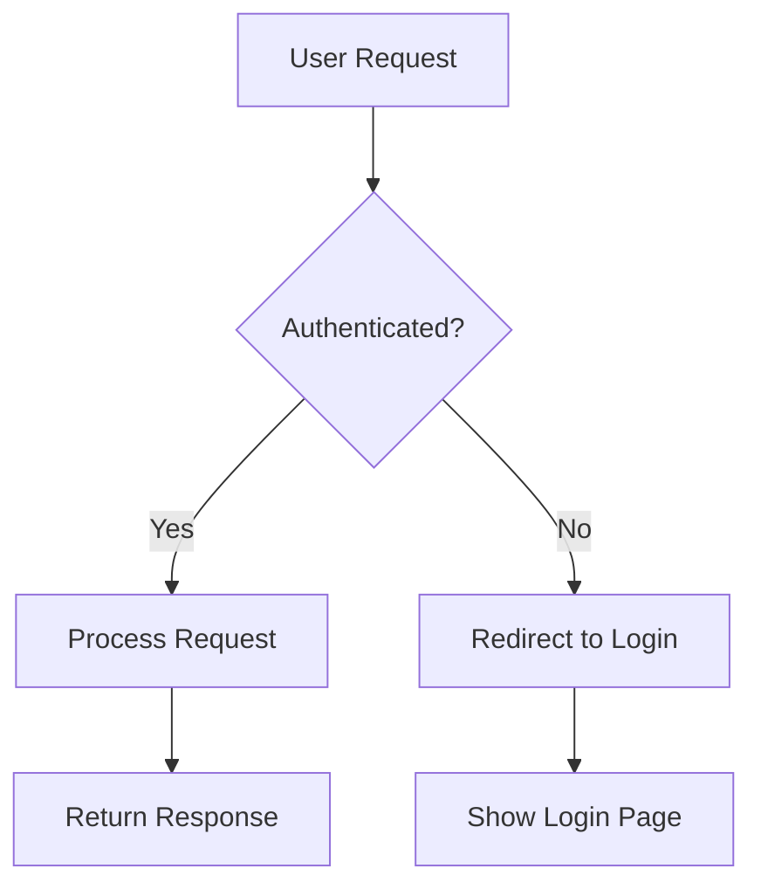
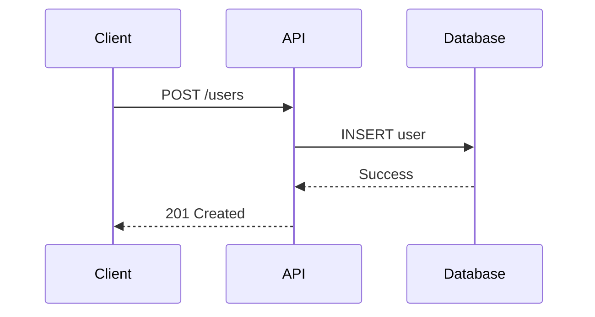
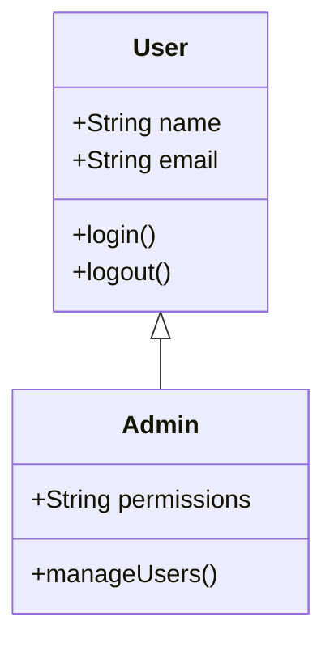
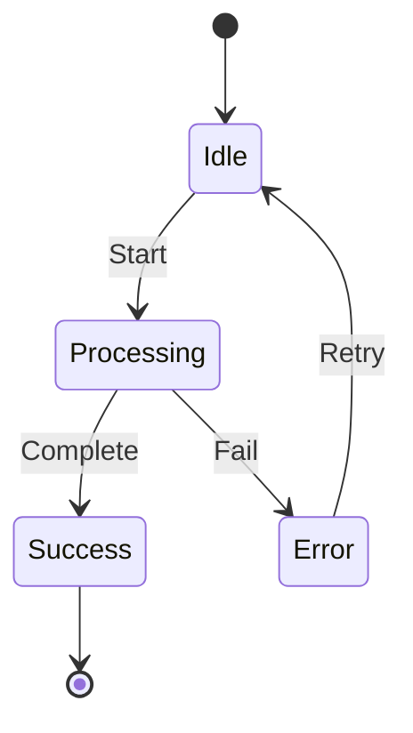
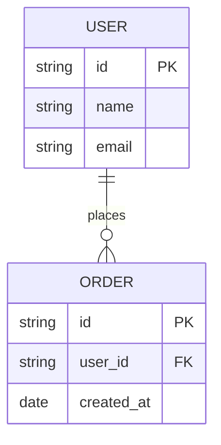
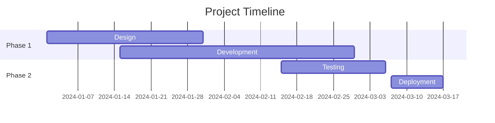
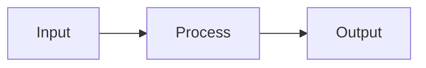

## Overview

Create interactive diagrams using Mermaid syntax. The component automatically adapts to light and dark themes, provides zoom controls, and supports fullscreen viewing for better diagram exploration.

Common use cases:
- Flowcharts for processes and workflows
- Sequence diagrams for API interactions
- System architecture diagrams
- State diagrams for application flows
- Entity relationship diagrams for database schemas
- Gantt charts for project timelines



## Basic syntax

Use Mermaid code blocks with triple backticks and the `mermaid` language identifier:

````markdown

````


<Callout kind="info">
  Diagrams automatically switch between light and dark themes based on your site's theme settings.
</Callout>

## Interactive features

### Zoom controls

Hover over any diagram to reveal zoom controls in the top-right corner:

- **Zoom In** - Magnify the diagram up to 300%
- **Zoom Out** - Reduce the diagram down to 50%
- **Reset** - Click the percentage to reset to 100%
- **Fullscreen** - View the diagram in fullscreen mode



<Callout kind="tip">
  Use fullscreen mode for complex diagrams with many nodes and connections.
</Callout>

## Diagram types

### Flowcharts

Visualize processes, workflows, and decision trees:

````markdown

````


### Sequence diagrams

Document API calls, interactions, and message flows:

````markdown

````


### Class diagrams

Show object-oriented structures and relationships:

````markdown

````


### State diagrams

Illustrate application states and transitions:

````markdown

````


### Entity relationship diagrams

Design database schemas and relationships:

````markdown

````


### Gantt charts

Plan project timelines and milestones:

````markdown

````


### Git graphs

Visualize branching strategies and workflows:

````markdown

````


## Graph directions

Control flowchart layout orientation:

| Direction | Code | Description |
|-----------|------|-------------|
| Top to Bottom | `graph TD` | Vertical flow (default) |
| Left to Right | `graph LR` | Horizontal flow |
| Bottom to Top | `graph BT` | Reverse vertical |
| Right to Left | `graph RL` | Reverse horizontal |

````markdown

````


## Node shapes

Customize node appearance in flowcharts:

````markdown
```mermaid
graph TD
    A[Rectangle]
    B(Rounded Rectangle)
    C([Stadium Shape])
    D[[Subroutine]]
    E[(Database)]
    F((Circle))
    G>Asymmetric]
    H{Diamond}
    I{{Hexagon}}
```
````

```mermaid
graph TD
    A[Rectangle]
    B(Rounded Rectangle)
    C([Stadium Shape])
    D[[Subroutine]]
    E[(Database)]
    F((Circle))
    G>Asymmetric]
    H{Diamond}
    I{{Hexagon}}
```

## Arrow types

Define different connection styles:

````markdown
```mermaid
graph LR
    A --> B
    C --- D
    E -.-> F
    G ==> H
    I -- Text --> J
```
````

```mermaid
graph LR
    A --> B
    C --- D
    E -.-> F
    G ==> H
    I -- Text --> J
```

## Theme support

Diagrams automatically match your documentation theme:

- **Light mode** - Uses default Mermaid theme with light backgrounds
- **Dark mode** - Uses dark Mermaid theme with appropriate colors
- **Automatic switching** - Updates when theme changes

<Callout kind="success">
  No additional configuration needed. Theme switching is automatic and instant.
</Callout>

## Syntax

<ParamField path="language" param-type="string" required="true" showLocation="false">
  Use `mermaid` as the language identifier in fenced code blocks.
</ParamField>

<ParamField path="chart" param-type="string" required="true" showLocation="false">
  Mermaid diagram definition using valid Mermaid syntax.
</ParamField>

<ParamField path="id" param-type="string" required="false" showLocation="false">
  Custom identifier for the diagram. Auto-generated if not provided.
</ParamField>

## Common patterns

- **API documentation** - Sequence diagrams showing request/response flows
- **Architecture diagrams** - Flowcharts illustrating system components
- **State machines** - State diagrams for complex application logic
- **Database design** - ER diagrams showing table relationships
- **Project planning** - Gantt charts with milestones and deadlines
- **Git workflows** - Branch strategies and merge patterns
- **Process documentation** - Flowcharts with decision points
- **Tutorial flows** - Step-by-step visual guides

## Best practices

**Diagram complexity:**
- Keep diagrams focused on a single concept
- Break complex systems into multiple diagrams
- Use subgraphs for logical grouping
- Limit nodes to 10-15 for readability

**Labeling:**
- Use clear, concise node labels
- Add descriptive text to connections
- Include legends for complex diagrams
- Maintain consistent terminology

**Layout:**
- Choose appropriate direction (TD, LR, etc.)
- Use proper node shapes for context
- Space nodes evenly for clarity
- Test in both light and dark themes

**Accessibility:**
- Provide text descriptions for complex diagrams
- Use sufficient color contrast
- Include alternative text explanations
- Test zoom functionality for details

## Mermaid resources

- **Official Documentation** - [mermaid.js.org](https://mermaid.js.org)
- **Live Editor** - [mermaid.live](https://mermaid.live) for testing syntax
- **Syntax Reference** - Complete guide to all diagram types
- **Examples Gallery** - Collection of diagram templates

<Callout kind="tip">
  Use the Mermaid Live Editor to prototype and validate your diagrams before adding them to documentation.
</Callout>
