## Overview

Use Mermaid diagrams to add flowcharts, sequence diagrams, and other structured visuals directly in your docs. In Documentation.AI, Mermaid diagrams are rendered from fenced code blocks and automatically gain:

- **Interactive zoom controls** (in and out, plus reset)

- **Fullscreen viewing** for complex diagrams

- **Automatic light/dark theme support** that matches your site

Mermaid is a good fit when you want:

- Repeatable, version-controlled diagrams defined in text

- Architecture or API flows that evolve with your product

- Visual explanations that stay readable across themes and layouts

Diagrams are created using the same code block system as other snippets. For a detailed overview of code blocks, see [Code and Groups](/components/code-blocks-and-groups).

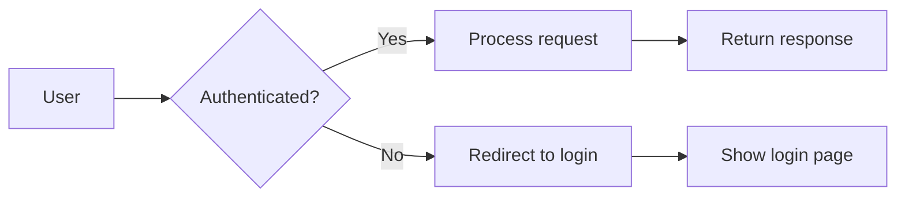

<Callout kind="info" collapsed="false">
  Diagrams automatically switch between light and dark themes based on your site's theme settings.
</Callout>

## Using with Web Editor

In the Web Editor, Mermaid diagrams are just code blocks with the language set to `mermaid`.

1. Open or create a page in the [Web Editor](/write-and-publish/web-editor).

2. Use the slash menu (<kbd>/</kbd>) to insert a **Code** block.

3. In the code block language dropdown, choose `mermaid`.

4. Paste or write your Mermaid definition inside the block.

For example, in the Web Editor you would configure a code block with language `mermaid` and content similar to:

<Image src="https://blob-cdn.documentation.ai/org-53a37986-2c9e-4094-b9e8-1e1ffae9e9ee/doc-b389b141-ae58-4fd5-91f9-6702fae9ac58/1767254767348-phbxb9ykbp-pasted-image-1767254765544.png?q=85&fm=auto&auto=compress%2Cformat" width="600" height="110" alt="Write Mermaid in Code Block" caption="Write Mermaid in Code Block" style="width: 600px; height: auto; cursor: pointer; margin: 0 auto;" />

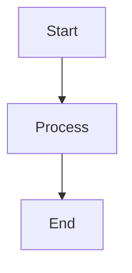

<Callout kind="info" collapsed="false">
  Prefer writing in code?

  You can switch to **MDX view inside the Web Editor** to write or edit this component using the same syntax as the Code Editor. This is useful if you want full control while staying in the Web Editor.
</Callout>

For more on inserting and configuring code blocks in the Web Editor, see [Code and Groups](/components/code-blocks-and-groups).

## Using with Code Editor

In the Code Editor (Markdown/MDX), Mermaid diagrams are defined as fenced code blocks with the `mermaid` language identifier.

### Basic Syntax

````markdown

````

Rendered example:


You can mix Mermaid blocks with any other Markdown or MDX content, including [Code and Groups](/components/code-blocks-and-groups) when you want to show Mermaid alongside other languages.

### Zoom controls

Hover over any diagram to reveal zoom controls in the top-right corner:

- **Zoom In** - Magnify the diagram up to 300%

- **Zoom Out** - Reduce the diagram down to 50%

- **Reset** - Click the percentage to reset to 100%

- **Fullscreen** - View the diagram in fullscreen mode

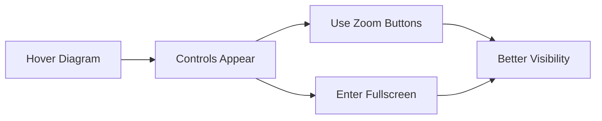

<Callout kind="tip" collapsed="false">
  Use fullscreen mode for complex diagrams with many nodes and connections.
</Callout>

## Advanced Options

### Diagram types:

### Flowcharts

Visualize processes, workflows, and decision trees:

````markdown
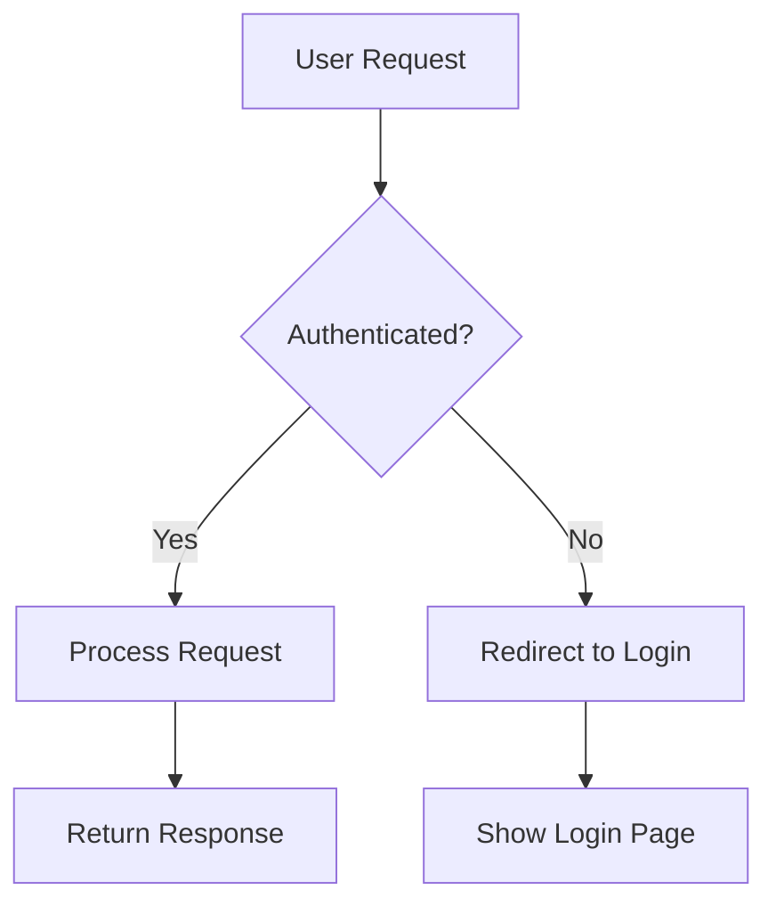
````


### Sequence diagrams

Document API calls, interactions, and message flows:

````markdown
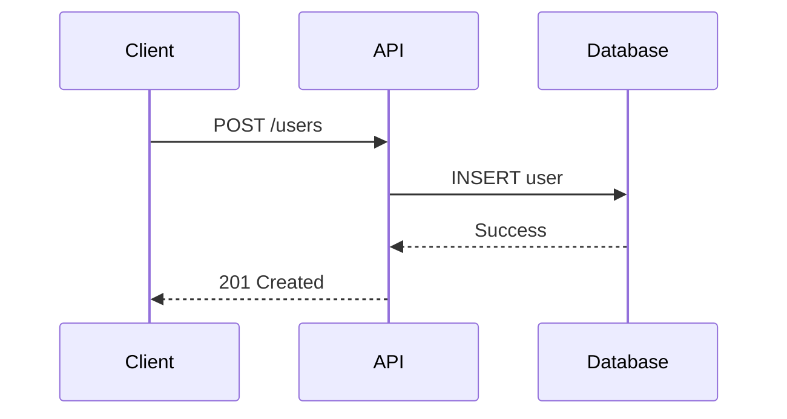
````


### Class diagrams

Show object-oriented structures and relationships:

````markdown
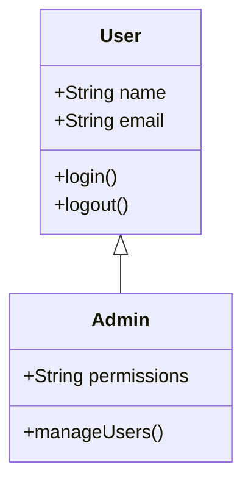
````


### State diagrams

Illustrate application states and transitions:

````markdown
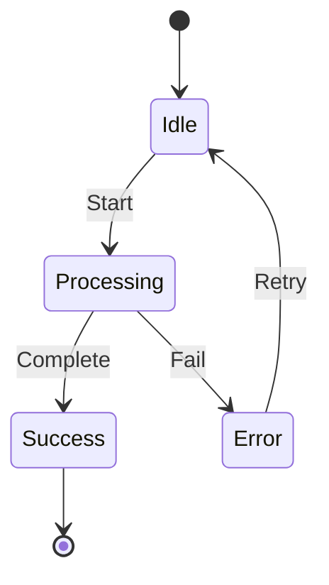
````


### Entity relationship diagrams

Design database schemas and relationships:

````markdown
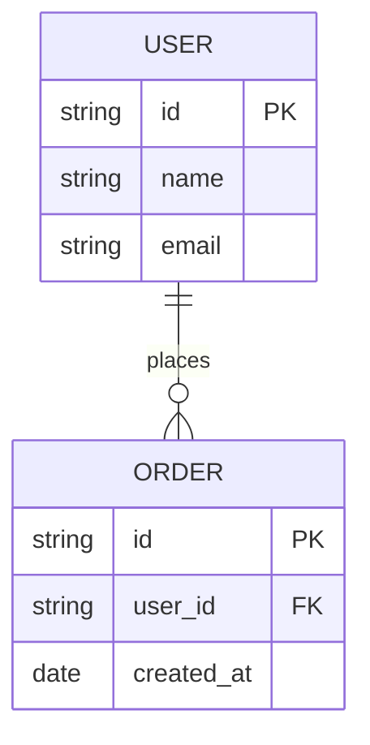
````


### Gantt charts

Plan project timelines and milestones:

````markdown
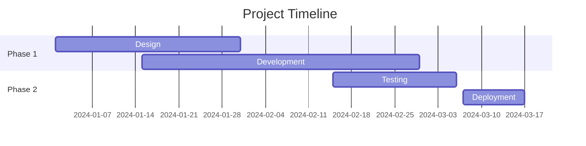
````


### Git graphs

Visualize branching strategies and workflows:

````markdown
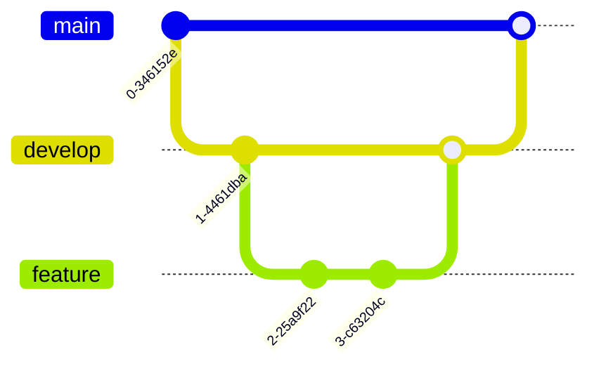
````


### Graph directions:

Control flowchart layout orientation:

| Direction     | Code       | Description             |
| ------------- | ---------- | ----------------------- |
| Top to Bottom | `graph TD` | Vertical flow (default) |
| Left to Right | `graph LR` | Horizontal flow         |
| Bottom to Top | `graph BT` | Reverse vertical        |
| Right to Left | `graph RL` | Reverse horizontal      |

````markdown
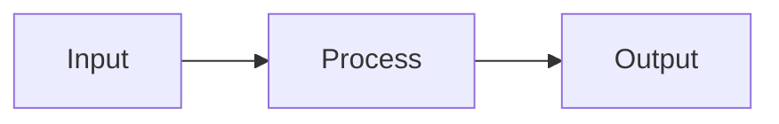
````

```mermaid
graph LR
    A[Input] --> B[Process] --> C[Output]
```

### Node shapes

Customize node appearance in flowcharts:

````markdown
```mermaid
graph TD
    A[Rectangle]
    B(Rounded Rectangle)
    C([Stadium Shape])
    D[[Subroutine]]
    E[(Database)]
    F((Circle))
    G>Asymmetric]
    H{Diamond}
    I{{Hexagon}}
```
````

```mermaid
graph TD
    A[Rectangle]
    B(Rounded Rectangle)
    C([Stadium Shape])
    D[[Subroutine]]
    E[(Database)]
    F((Circle))
    G>Asymmetric]
    H{Diamond}
    I{{Hexagon}}
```

### Arrow types

Define different connection styles:

````markdown
```mermaid
graph LR
    A --> B
    C --- D
    E -.-> F
    G ==> H
    I -- Text --> J
```
````

```mermaid
graph LR
    A --> B
    C --- D
    E -.-> F
    G ==> H
    I -- Text --> J
```

### Theme support

Diagrams automatically match your documentation theme:

- **Light mode** - Uses default Mermaid theme with light backgrounds

- **Dark mode** - Uses dark Mermaid theme with appropriate colors

- **Automatic switching** - Updates when theme changes

<Callout kind="success" collapsed="false">
  No additional configuration needed. Theme switching is automatic and instant.
</Callout>

### Syntax

<ParamField path="language" param-type="string" required="true" deprecated="false">
  Use `mermaid` as the language identifier in fenced code blocks.
</ParamField>

<ParamField path="chart" param-type="string" required="true" deprecated="false">
  Mermaid diagram definition using valid Mermaid syntax.
</ParamField>

<ParamField path="id" param-type="string" required="false" deprecated="false">
  Custom identifier for the diagram. Auto-generated if not provided.
</ParamField>

### Best practices

Keep diagrams readable and accessible:

- Focus each diagram on a single concept or flow

- Prefer 10–15 nodes or fewer per diagram

- Use clear, concise labels for nodes and edges

- Check readability in both light and dark themes

- Add nearby text that explains the diagram for screen readers

<Callout kind="tip" collapsed="false">
  Use the Mermaid Live Editor at [mermaid.live](https://mermaid.live) to prototype and validate your diagrams before adding them to your documentation.
</Callout>

