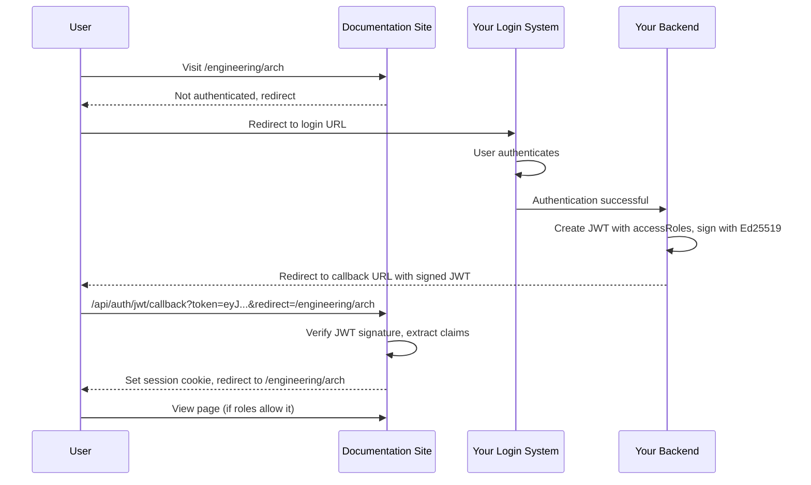

<Callout kind="warning" collapsed="false">
  JWT authentication is available on Enterprise plans or higher.
</Callout>

Authenticate users with JSON Web Tokens (JWT) signed with Ed25519 (EdDSA). This method integrates your documentation with your existing authentication system and supports per-user [role-based access control](/customize/access-control/overview#role-based-access-control) and personalization.

## Prerequisites

- An Enterprise plan or higher
- An authentication system that can generate and sign JWTs
- A backend service that can create redirect URLs back to your docs

## Set up

<Steps>
  <Step title="Select JWT in the dashboard" icon="settings" title-type="p">
    In your dashboard, go to **Settings > Access Control**, select **Private**, then choose **JWT** as the authentication method. JWT is only available in Private mode (not Partial).
  </Step>

  <Step title="Generate a signing key" icon="key" title-type="p">
    Click **Generate signing key** in the dashboard. This creates an Ed25519 keypair:

    - The **public key** is stored by Documentation.AI and used to verify incoming JWTs.
    - The **private key** is shown once for you to download. Store it securely where your backend can access it.

    <Callout kind="alert" collapsed="false">
      The private key is only shown once. Download it immediately and store it securely. If you lose it, generate a new keypair using the **Regenerate** button.
    </Callout>
  </Step>

  <Step title="Configure login URL" icon="link" title-type="p">
    Enter the URL of your existing login page. When an unauthenticated user visits your docs, they are redirected to this URL.
  </Step>

  <Step title="Configure optional settings" icon="settings" title-type="p">
    - **Issuer**: Expected `iss` claim in the JWT. If set, tokens with a different issuer are rejected.
    - **Audience**: Expected `aud` claim in the JWT. Typically your docs domain.
    - **Session duration**: How long a user stays authenticated after signing in (default: 14 days).
  </Step>

  <Step title="Copy the callback URL" icon="clipboard" title-type="p">
    Copy the **Callback URL** shown in the dashboard. You will redirect users to this URL after they authenticate.
  </Step>

  <Step title="Save and re-publish" icon="upload" title-type="p">
    Save your settings and re-publish your documentation.
  </Step>
</Steps>

## Integrate with your backend

After a user successfully authenticates in your system:

### 1. Create the JWT

Build a JWT with the following claims:

```json
{
  "host": "docs.example.com",
  "firstname": "Alice",
  "company": "Acme Inc",
  "accessRoles": ["engineering", "sre"],
  "iat": 1743523200,
  "exp": 1743523230
}
```

| Claim | Required | Description |
|---|---|---|
| `host` | No | The docs site hostname (for personalization) |
| `firstname` | No | User's first name (for personalization) |
| `company` | No | User's company name (for personalization) |
| `accessRoles` | No | Array of role strings for [role-based access control](/customize/access-control/overview#role-based-access-control). Omit if not using scoped access. Use `["*"]` for full access. |
| `iat` | Yes | Issued-at timestamp (standard JWT claim) |
| `exp` | Yes | Expiration timestamp. Keep this short (30 seconds recommended) since this is a handshake token, not the session. |

If you set **Issuer** or **Audience** in the dashboard, include matching `iss` and `aud` claims.

### 2. Sign the JWT

Sign the JWT using the **Ed25519 (EdDSA)** algorithm with the private key you downloaded during setup.

```javascript
import { SignJWT, importPKCS8 } from 'jose';

const privateKey = await importPKCS8(privateKeyPem, 'EdDSA');

const jwt = await new SignJWT({
  host: 'docs.example.com',
  firstname: 'Alice',
  company: 'Acme Inc',
  accessRoles: ['engineering', 'sre'],
})
  .setProtectedHeader({ alg: 'EdDSA' })
  .setIssuedAt()
  .setExpirationTime('30s')
  .sign(privateKey);
```

### 3. Redirect to the callback URL

Redirect the user to the callback URL shown in your dashboard, passing the signed JWT as the `token` parameter:

```
https://docs.example.com/api/auth/jwt/callback?token=eyJ...&redirect=/getting-started
```

The optional `redirect` parameter preserves the user's intended destination. If omitted, the user lands on the docs homepage.

## Authentication flow



## Key rotation

To rotate the signing key, click **Regenerate** in the dashboard. This generates a new keypair:

- Download the new private key and deploy it to your backend.
- The old private key's tokens will fail verification immediately.
- Active sessions (cookie-based) remain valid until they expire.

Rotate keys during scheduled maintenance or incident response.

## Example

You host docs at `docs.example.com` and your company login is `https://login.example.com`. Configure JWT authentication so users sign in with your existing identity system, then return to the docs site with a signed token.
