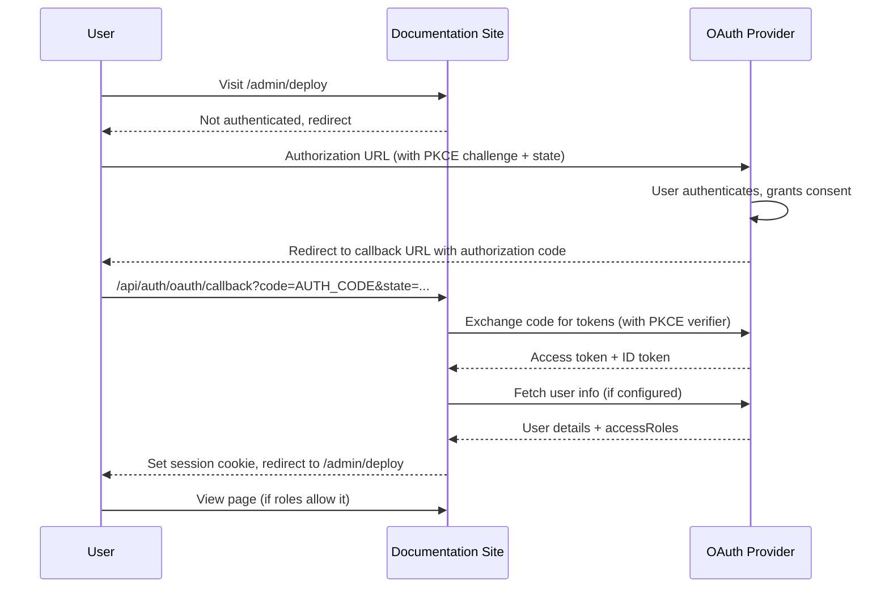

<Callout kind="warning" collapsed="false">
  OAuth 2.0 authentication is available on Enterprise plans or higher.
</Callout>

Authenticate users with OAuth 2.0 or OpenID Connect (OIDC). This method integrates with popular identity providers (Okta, Auth0, Azure AD, Google Workspace, etc.) and supports per-user [role-based access control](/docs/customize/access-control/overview#role-based-access-control) and personalization.

Documentation.AI uses the **Authorization Code flow with PKCE** for enhanced security.

## Prerequisites

- An Enterprise plan or higher
- An OAuth 2.0 or OIDC provider that supports the Authorization Code flow

## Set up

<Steps>
  <Step title="Select OAuth 2.0 in the dashboard" icon="settings" title-type="p">
    In your dashboard, go to **Settings > Access Control**, select **Private**, then choose **OAuth 2.0** as the authentication method. OAuth 2.0 is only available in Private mode (not Partial).
  </Step>

  <Step title="Configure provider URLs" icon="link" title-type="p">
    Enter the following from your OAuth provider:

    - **Authorization URL**: The endpoint where users are redirected to sign in (e.g., `https://provider.example.com/authorize`).
    - **Token URL**: The endpoint used server-side to exchange the authorization code for tokens (e.g., `https://provider.example.com/oauth/token`).
  </Step>

  <Step title="Configure client credentials" icon="key" title-type="p">
    - **Client ID**: The public identifier for your application, provided by your OAuth provider.
    - **Client Secret**: The secret key for your application. This is encrypted before storage.
  </Step>

  <Step title="Configure optional settings" icon="settings" title-type="p">
    - **Scopes**: Space-separated OAuth scopes to request (e.g., `openid profile email groups`). Include scopes that return the user's roles or groups.
    - **User Info URL**: Optional. Used to fetch user details (roles, name, company) if they are not included in the ID token.
    - **Logout URL**: Optional. After logging out of your docs, users are redirected here to also end their session with the OAuth provider.
    - **Session duration**: How long a user stays authenticated (default: 7 days). If the provider's token includes an `exp` claim, that expiry takes priority.
  </Step>

  <Step title="Register the callback URL" icon="clipboard" title-type="p">
    Copy the **Callback URL** shown in the dashboard and add it to your OAuth provider's allowed redirect URIs.

    <Callout kind="info" collapsed="false">
      The callback URL is based on your documentation's domain. If you change your domain, update the redirect URI in your provider settings.
    </Callout>
  </Step>

  <Step title="Save and re-publish" icon="upload" title-type="p">
    Save your settings and re-publish your documentation.
  </Step>
</Steps>

## Token claims

Documentation.AI extracts user identity and access roles from the ID token or the User Info endpoint response. Include the following fields:

```json
{
  "host": "docs.example.com",
  "firstname": "Alice",
  "company": "Acme Inc",
  "accessRoles": ["engineering", "sre"]
}
```

| Field | Required | Description |
|---|---|---|
| `host` | No | The docs site hostname (for personalization) |
| `firstname` | No | User's first name (for personalization) |
| `company` | No | User's company name (for personalization) |
| `accessRoles` | No | Array of role strings for [role-based access control](/docs/customize/access-control/overview#role-based-access-control). Omit if not using scoped access. Use `["*"]` for full access. |

<Callout kind="info" collapsed="false">
  If your provider uses different field names (e.g., `groups` instead of `accessRoles`), configure your provider to emit these exact field names, or use a claims transformation in your provider's settings.
</Callout>

## Authentication flow



## Security

- **PKCE (Proof Key for Code Exchange)**: Prevents authorization code interception attacks. The code challenge is generated per-request and verified during token exchange.
- **State parameter**: A cryptographic random value stored in an encrypted HttpOnly cookie prevents CSRF attacks during the OAuth flow.
- **Client secret encryption**: Your client secret is encrypted with AES-256-GCM before storage and only decrypted at deployment time.

## Provider-specific notes

### Okta

- Authorization URL: `https://{your-domain}.okta.com/oauth2/v1/authorize`
- Token URL: `https://{your-domain}.okta.com/oauth2/v1/token`
- User Info URL: `https://{your-domain}.okta.com/oauth2/v1/userinfo`
- Scopes: `openid profile email groups`
- Configure your Okta application to include `accessRoles` in the ID token claims, or use a claims transformation to map `groups` to `accessRoles`.

### Auth0

- Authorization URL: `https://{your-domain}.auth0.com/authorize`
- Token URL: `https://{your-domain}.auth0.com/oauth/token`
- User Info URL: `https://{your-domain}.auth0.com/userinfo`
- Scopes: `openid profile email`
- Use an Auth0 Action (Post-Login) to add `accessRoles` as a custom claim.

### Azure AD / Entra ID

- Authorization URL: `https://login.microsoftonline.com/{tenant-id}/oauth2/v2.0/authorize`
- Token URL: `https://login.microsoftonline.com/{tenant-id}/oauth2/v2.0/token`
- Scopes: `openid profile email`
- Configure App Roles in your Azure AD application registration and map them to `accessRoles`.

## Example

You host docs at `docs.example.com` and use Okta for user sign-in. Configure OAuth 2.0 authentication so visitors authenticate via Okta before accessing protected pages. Users in the "engineering" group see engineering docs, while "admin" users see everything.
