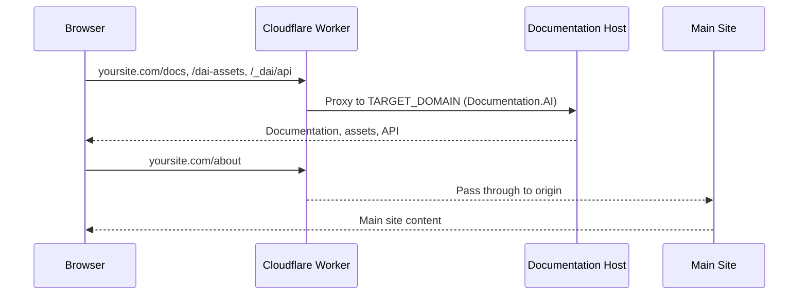

## Overview

Use Cloudflare Workers to serve your Documentation.AI site at a custom subpath like `yoursite.com/docs`. The Worker acts as a reverse proxy, forwarding documentation and asset requests to your Documentation.AI host while keeping the rest of your site unchanged.

<Callout kind="info" collapsed="false">
  Prerequisites:

  - Cloudflare account with your domain managed in Cloudflare DNS

  - DNS record for your site (`A` or `CNAME`) set to **proxied** (orange cloud on)

  - Documentation published at your Documentation.AI host domain (for example, `mydocs.documentationai.io`)

  - Desired docs path (for example, `/docs`)
</Callout>

## How it works



The Worker intercepts matching routes on your domain and forwards only documentation traffic to Documentation.AI:

- `/docs` and `/docs/*` → proxied to your Documentation.AI domain

- `/dai-assets/*` and `/_dai/api/*` → proxied for static assets and API

- `/.well-known/*` → passed through for SSL and verification

- All other paths → passed through to your main site origin

SEO helper files under `/docs` (like `/docs/robots.txt`) are rewritten to the correct paths on the documentation host so that crawlers see the right content.

## Step 1: Ensure DNS is proxied (orange cloud)

<Steps>
  <Step title="Open DNS settings" title-type="p">
    In the Cloudflare dashboard, select your domain and go to **DNS**.
  </Step>

  <Step title="Check your main record" title-type="p">
    Locate the DNS record that serves your main site (for example, an `A` record to your server or a `CNAME` to your hosting provider).
  </Step>

  <Step title="Enable proxy" title-type="p">
    Make sure the cloud icon for that record is **orange** (proxied). If it is gray, click it to turn on proxying so requests flow through Cloudflare and can be intercepted by the Worker.
  </Step>
</Steps>

Your site should still load as usual at `https://yoursite.com` after this change.

## Step 2: Create the Worker

<Steps>
  <Step title="Open Workers & Pages" title-type="p">
    From your domain in Cloudflare, go to **Workers & Pages** and open the **Workers** section.
  </Step>

  <Step title="Create a new Worker" title-type="p">
    Click **Create application** → **Create Worker**, choose the **Hello World** starter if prompted, and click **Deploy**.
  </Step>

  <Step title="Name the Worker" title-type="p">
    Give the Worker a clear name like `docs-subpath-proxy` and confirm the deployment.
  </Step>
</Steps>

After deployment, Cloudflare shows a default `workers.dev` URL and a basic Hello World script.

## Step 3: Configure the multi-route proxy script

<Steps>
  <Step title="Open the code editor" title-type="p">
    On the Worker page, click **Edit code** to open the editor for your Worker script.
  </Step>

  <Step title="Replace the default script" title-type="p">
    Delete the default Hello World code and paste the script below in its place.&#x20;

    ```javascript
    // Cloudflare Worker - Multi-Route Proxy
    // Proxies requests from custom domain to documentation platform

    addEventListener("fetch", (event) => {
      event.respondWith(handleRequest(event.request));
    });

    async function handleRequest(request) {
      try {
        const url = new URL(request.url);
        const originalDomain = url.hostname;

        // ============ CONFIGURATION ============
        // Target domain where docs are hosted
        const TARGET_DOMAIN = "YOUR_SUBDOMAIN.documentationai.com";
        // Base path where docs are mounted on your site (e.g. "/docs", "/help", "/knowledge-base")
        const DOCS_PATH = "/docs";
        // =======================================

        // Escape DOCS_PATH for safe use in RegExp
        const escapedDocsPath = DOCS_PATH.replace(/[.*+?^${}()|[\]\\]/g, "\\$&");

        // Handle domain verification paths (Let's Encrypt, Vercel, etc.)
        if (url.pathname.startsWith("/.well-known/")) {
          return await fetch(request);
        }

        // Define routing rules
        const routes = [
          // Special file rewrites - MUST come first (most specific)
          {
            pattern: new RegExp(`^${escapedDocsPath}/llms\\.txt$`),
            targetPath: "/llms.txt",
          },
          {
            pattern: new RegExp(`^${escapedDocsPath}/llms-full\\.txt$`),
            targetPath: "/llms-full.txt",
          },
          {
            pattern: new RegExp(`^${escapedDocsPath}/sitemap\\.xml$`),
            targetPath: "/sitemap.xml",
          },
          {
            pattern: new RegExp(`^${escapedDocsPath}/robots\\.txt$`),
            targetPath: "/robots.txt",
          },
          // API routes - keep full path
          {
            pattern: /^\/_dai\/api\/.*/,
            targetPath: null, // null = use original path
          },
          // Static asset routes - keep full path
          {
            pattern: /^\/dai-assets\/.*/,
            targetPath: null,
          },
          // Docs routes - keep full path including docs prefix
          {
            pattern: new RegExp(`^${escapedDocsPath}(\\/.*)?$`),
            targetPath: null,
          },
        ];

        // Check if the current path matches any proxy route
        const matchedRoute = routes.find((route) => route.pattern.test(url.pathname));

        if (matchedRoute) {
          // Use rewritten path or original path
          const targetPath =
            matchedRoute.targetPath !== null
              ? matchedRoute.targetPath
              : url.pathname;

          // Build the target URL
          const targetUrl = `https://${TARGET_DOMAIN}${targetPath}${url.search}`;

          // Create new request with proper headers
          const proxyRequest = new Request(targetUrl, {
            method: request.method,
            headers: new Headers(request.headers),
            body: request.body,
            redirect: "follow",
          });

          // Set essential proxy headers
          proxyRequest.headers.set("Host", TARGET_DOMAIN);
          proxyRequest.headers.set("X-Forwarded-Host", originalDomain);
          proxyRequest.headers.set("X-Forwarded-Proto", "https");

          // Forward real client IP for analytics and logging
          const clientIP = request.headers.get("CF-Connecting-IP");
          if (clientIP) {
            proxyRequest.headers.set("CF-Connecting-IP", clientIP);
            proxyRequest.headers.set("X-Forwarded-For", clientIP);
            proxyRequest.headers.set("X-Real-IP", clientIP);
          }

          // Optimize caching for static assets (dai-assets prefix)
          if (url.pathname.startsWith("/dai-assets/")) {
            proxyRequest.headers.set(
              "Cache-Control",
              "public, max-age=31536000, immutable"
            );
          }

          // Make the proxy request
          const response = await fetch(proxyRequest);

          // Clone the response to modify headers
          const modifiedResponse = new Response(response.body, {
            status: response.status,
            statusText: response.statusText,
            headers: new Headers(response.headers),
          });

          // Add security and CORS headers
          modifiedResponse.headers.set("X-Frame-Options", "SAMEORIGIN");
          modifiedResponse.headers.set("X-Content-Type-Options", "nosniff");
          modifiedResponse.headers.set("Access-Control-Allow-Origin", "*");
          modifiedResponse.headers.set(
            "Access-Control-Allow-Methods",
            "GET, POST, PUT, DELETE, OPTIONS"
          );
          modifiedResponse.headers.set(
            "Access-Control-Allow-Headers",
            "Content-Type, Authorization"
          );

          return modifiedResponse;
        }

        // All other routes pass through normally
        return await fetch(request);
      } catch (error) {
        console.error("Worker error:", error);

        // Return user-friendly error response
        return new Response(
          "Proxy Error: Unable to fetch content. Please try again later.",
          {
            status: 502,
            statusText: "Bad Gateway",
            headers: {
              "Content-Type": "text/plain",
              "Cache-Control": "no-cache",
            },
          }
        );
      }
    }
    ```
  </Step>

  <Step title="Set TARGET_DOMAIN" title-type="p">
    In the script, update `TARGET_DOMAIN and DOCS_PATH` to your Documentation.AI host domain
  </Step>
</Steps>

<Callout kind="info" collapsed="false">
  This Worker:

  - Proxies `/docs`, `/dai-assets/*`, and `/_dai/api/*` to your Documentation.AI host.

  - Rewrites key SEO files under `/docs` (robots.txt, sitemap.xml, llms.txt) to the correct paths on the docs host.

  - Passes `/.well-known/*` through directly to your origin.

  - Lets all other routes go to your main site unchanged and returns a 502 error if the proxy fails.
</Callout>

###

## Step 4: Quick test with the Worker preview URL

<Steps>
  <Step title="Copy the preview URL" title-type="p">
    In the Worker editor, use the **Preview** panel or deployment summary to copy the Worker URL ending in `.workers.dev` (for example, `https://docs-subpath-proxy.your-account.workers.dev`).
  </Step>

  <Step title="Test /docs on the preview URL" title-type="p">
    Visit `https://YOUR_WORKER_URL/YOUR_SUBPATH` in your browser. You should see your Documentation.AI site load from the Worker.


  </Step>
</Steps>

## Step 5: Attach Worker routes to your domain

<Steps>
  <Step title="Open Domains & Routes" title-type="p">
    From your Worker, go to **Settings** → **Domains & Routes** (or **Triggers**, depending on your Cloudflare UI version).
  </Step>

  <Step title="Add documentation routes" title-type="p">
    Add these routes, one by one, pointing to this Worker:

    - `yoursite.com/docs`

    - `yoursite.com/docs/*`

    - `yoursite.com/dai-assets/*`

    - `yoursite.com/_dai/api/*`
  </Step>

  <Step title="Set fail mode to Fail closed" title-type="p">
    For the Worker routes, set **Fail mode** to **Fail closed (block)** so that if the Worker is unavailable, Cloudflare blocks those paths instead of serving partial or incorrect content.
  </Step>

  <Step title="Save route configuration" title-type="p">
    Save your routes. Your Worker now intercepts documentation, asset, and API traffic on your real domain.
  </Step>
</Steps>

Once saved, hitting `https://yoursite.com/docs` should trigger the Worker instead of going directly to your origin.

## Step 6: Redeploy docs in Documentation.AI

<Steps>
  <Step title="Open Documentation.AI domain settings" title-type="p">
    In Documentation.AI, go to your project and open **Domain** **settings** where your Documentation.AI host domain is configured.
  </Step>

  <Step title="Republish your documentation" title-type="p">
    Click **Re-Publish,&#x20;**&#x73;o your documentation host is fully up to date and ready to serve requests coming through Cloudflare.
  </Step>

  <Step title="Verify your subpath" title-type="p">
    Visit `https://yoursite.com/subpath` and a few nested pages. Also check `/subpath/robots.txt`, `/subpath/llms.txt`, and `/subpath/sitemap.xml` to confirm SEO files are served correctly via the Worker rewrites.
  </Step>
</Steps>

<Callout kind="success" collapsed="false">
  Your documentation now runs at your custom subpath with assets, API routes, and SEO helper files correctly proxied through Cloudflare Workers.
</Callout>

## Troubleshooting

<ExpandableGroup>
  <Expandable title="Docs 404 or main site shows instead of docs" default-open="false">
    **Symptom:** `yoursite.com/docs` returns 404 or shows your main site.

    **Checks:**

    1. Confirm the Worker preview URL works at `YOUR_WORKER_URL/docs`.

    2. Verify routes under **Settings → Domains & Routes** include `yoursite.com/docs` and `yoursite.com/docs/*` attached to this Worker.

    3. Ensure your DNS record for `yoursite.com` is **proxied** (orange cloud) in Cloudflare DNS.

    4. Check that `TARGET_DOMAIN` in the Worker script matches your Documentation.AI host (for example, `mydocs.documentationai.io`).
  </Expandable>

  <Expandable title="Assets or styles not loading" default-open="false">
    **Symptom:** Pages load but CSS, JavaScript, or images fail under `/docs`.

    **Checks:**

    1. Confirm the routes `yoursite.com/dai-assets/*` and `yoursite.com/_dai/api/*` are added and bound to the same Worker.

    2. Open the browser Network tab and verify asset requests hit the Worker routes (response headers should include Cloudflare and Worker information).

    3. Ensure your Worker script is unmodified for these paths and still includes the asset and API checks (`/dai-assets/`, `/_dai/api/`).
  </Expandable>

  <Expandable title="SEO files missing or incorrect" default-open="false">
    **Symptom:** `/docs/robots.txt`, `/docs/llms.txt`, or `/docs/sitemap.xml` return 404 or unexpected content.

    **Checks:**

    1. Confirm the Worker script contains the SEO rewrite rules for `/docs/robots.txt`, `/docs/llms-full.txt`, `/docs/llms.txt`, and `/docs/sitemap.xml`.

    2. Make sure those files exist and are configured in your Documentation.AI project.

    3. Visit the underlying paths on `https://TARGET_DOMAIN/robots.txt`, `https://TARGET_DOMAIN/llms.txt`, and `https://TARGET_DOMAIN/sitemap.xml` to ensure they resolve.
  </Expandable>

  <Expandable title="Worker does not seem to run at all" default-open="false">
    **Symptom:** Changes to the Worker script do not affect `yoursite.com/docs`.

    **Checks:**

    1. Verify the Worker is **deployed** (status should show active) after edits.

    2. In **Settings → Domains & Routes**, ensure the Worker is attached to the correct domain and route patterns with no typos.

    3. Check that you do not have another Worker or Page rule intercepting the same routes at higher priority.

    4. Clear your browser cache or try in a private window to avoid cached responses.
  </Expandable>

  <Expandable title="SSL or verification issues" default-open="false">
    **Symptom:** SSL warnings or problems with ACME/verification endpoints.

    **Checks:**

    1. Confirm the Worker script allows `/.well-known/` paths to pass through directly with `fetch(request)`.

    2. Verify Universal SSL is enabled for your domain in Cloudflare.

    3. Test `https://yoursite.com/.well-known/...` to ensure it reaches your origin as expecte
  </Expandable>
</ExpandableGroup>

