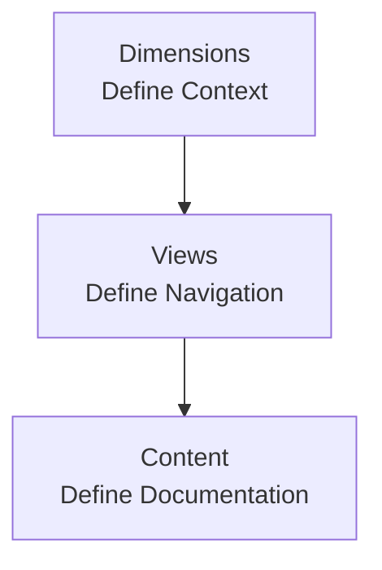

## Overview

Configure your documentation site using the `documentation.json` file. This file controls your site's branding, navigation structure, SEO settings, and API documentation generation.

## Site Configuration

Basic site settings that control your documentation's identity and behavior

```json
{
  "name": "Documentation.AI",
  "initialRoute": "getting-started/introduction"
}
```

<ParamField path="name" param-type="string" required="true" deprecated="false">
  Site name displayed in the browser title, navigation header, and social media
  previews.
</ParamField>

<ParamField path="initialRoute" param-type="string" required="false" deprecated="false">
  Default page path when users visit the root URL. Points to an MDX file in your
  documentation project (all pages must be in MDX format). Specify the path
  without the `.mdx` extension.
</ParamField>

## Template Configuration

Templates control the overall layout and visual style of your documentation site. They help you start from a structure that is already close to your product's needs, so you only have to fine-tune colors, navigation, and content.

Use the `template` field in `documentation.json` to pick between the built-in layouts:

- `"classic"` - Default layout focused on a familiar docs experience

- `"atlas"` - Alternative layout optimized for richer navigation and content density

You can declare the template field as `template: "classic" | "atlas"`.

If you do not set `template`, the system defaults to `"classic"`.

```json
{
  "name": "Documentation.AI",
  "template": "atlas",
  "initialRoute": "getting-started/introduction"
}
```

<ParamField path="template" param-type="string" required="false" deprecated="false">
  Site template that selects the base layout and style for your documentation.
  Accepted values: `"classic"` or `"atlas"`. Defaults to `"classic"` when not
  specified.
</ParamField>

## Branding Configuration

### Logo Configuration

Configure logo variants for different themes and sizes. All logo fields are optional and fallback to default assets.

```json
{
  "logo-dark": "https://example.com/logo-dark.svg",
  "logo-light": "https://example.com/logo-light.svg",
  "logo-small-dark": "https://example.com/favicon-dark.svg",
  "logo-small-light": "https://example.com/favicon-light.svg"
}
```

<ParamField path="logo-dark" param-type="string" required="false" deprecated="false">
  Main logo displayed in dark theme. Supports PNG, SVG, WEBP formats.
</ParamField>

<ParamField path="logo-light" param-type="string" required="false" deprecated="false">
  Main logo displayed in light theme.
</ParamField>

<ParamField path="logo-small-dark" param-type="string" required="false" deprecated="false">
  Small logo/favicon for dark theme. Used in browser tabs and mobile view.
</ParamField>

<ParamField path="logo-small-light" param-type="string" required="false" deprecated="false">
  Small logo/favicon for light theme.
</ParamField>

### Brand Colors

Customize your site's color scheme with automatic contrast optimization.

```json
{
  "colors": {
    "light": {
      "brand": "#3143e3",
      "heading": "#1a1a1a",
      "text": "#374151"
    },
    "dark": {
      "brand": "#85a1ff",
      "heading": "#f2f2f2",
      "text": "#c1c1c1"
    }
  }
}
```

### Light Theme Colors

<ParamField path="light" param-type="object" required="false" deprecated="false">
  Color scheme for light mode appearance.

  <Expandable title="Light Mode Color Options" default-open="false">
    <ParamField path="brand" param-type="string" required="false" deprecated="false">
      Primary brand color for buttons, links, and accents. Use hex format (e.g., `#3143e3`).
    </ParamField>

    <ParamField path="heading" param-type="string" required="false" deprecated="false">
      Heading and title text color. Default: `#1a1a1a`.
    </ParamField>

    <ParamField path="text" param-type="string" required="false" deprecated="false">
      Body text color for readability. Default: `#374151`.
    </ParamField>
  </Expandable>
</ParamField>

### Dark Theme Colors

<ParamField path="dark" param-type="object" required="false" deprecated="false">
  Color scheme for dark mode appearance.

  <Expandable title="Dark Mode Color Options" default-open="false">
    <ParamField path="brand" param-type="string" required="false" deprecated="false">
      Primary brand color optimized for dark backgrounds. Use hex format (e.g., `#85a1ff`).
    </ParamField>

    <ParamField path="heading" param-type="string" required="false" deprecated="false">
      Heading and title text color for dark mode. Default: `#f2f2f2`.
    </ParamField>

    <ParamField path="text" param-type="string" required="false" deprecated="false">
      Body text color for dark mode readability. Default: `#c1c1c1`.
    </ParamField>
  </Expandable>
</ParamField>

### Navbar Configuration

Configure the top navigation bar with action buttons and links.

```json
{
  "navbar": {
    "actions": {
      "primary": {
        "title": "Get Started",
        "link": "https://dashboard.example.com/signup"
      },
      "links": [
        {
          "title": "Login",
          "link": "https://dashboard.example.com/login"
        },
        {
          "title": "Support",
          "link": "mailto:support@example.com"
        }
      ]
    }
  }
}
```

### Primary Action Button

Configure the main call-to-action button that appears prominently in your navbar.

<ParamField path="primary" param-type="object" required="false" deprecated="false">
  Main action button for user engagement (e.g., "Get Started", "Sign Up", "Try Now").

  <Expandable title="Button Configuration" default-open="false">
    <ParamField path="title" param-type="string" required="true" deprecated="false">
      Text displayed on the button.
    </ParamField>

    <ParamField path="link" param-type="string" required="true" deprecated="false">
      Destination URL when clicked.
    </ParamField>
  </Expandable>
</ParamField>

### Secondary Navigation Links

Add supplementary text links for additional navigation options.

<ParamField path="links" param-type="array" required="false" deprecated="false">
  Array of secondary navigation links displayed as text in the navbar.

  <Expandable title="Link Configuration" default-open="false">
    <ParamField path="title" param-type="string" required="true" deprecated="false">
      Display text for the link.
    </ParamField>

    <ParamField path="link" param-type="string" required="true" deprecated="false">
      Target URL. Supports `mailto:` and `tel:` protocols for contact links.
    </ParamField>
  </Expandable>
</ParamField>

## Navigation Architecture

Our documentation system organizes information in three conceptual layers to help developers, writers, and AI agents reason about structure, rendering, and content discovery.



### Understanding the Three Layers

**Dimensions → Views → Content**

1. **Dimensions** define *where* in your documentation the reader currently is (e.g., which product, version, or language)

2. **Views** define *how* content is organized and navigated within that context (e.g., tabs or dropdowns)

3. **Content** defines *what* the reader sees (e.g., groups and pages of documentation)

<Callout kind="note" collapsed="false">
  **Navigation Rule**: Each container must choose exactly ONE child type. For
  example, a tab can contain `groups` OR `pages` OR `dropdowns`, but not
  multiple types simultaneously.
</Callout>

### Visibility Control with public

When using [partial access control](/customize/access-control), you can control which parts of your documentation are publicly accessible or protected using the `public` property. This property can be set on **any navigation node** across all three layers.

<ParamField path="public" param-type="boolean" required="false" deprecated="false">
  Controls visibility when access control mode is `partial`. Can be applied to dimensions, views, and content nodes.

  - `true` makes this node and its descendants public

  - `false` makes this node and its descendants protected

  - Omit to inherit from the nearest parent that defines it

  The closest explicit value wins for any subtree.
</ParamField>

<Callout kind="info" collapsed="false">
  The `public` property only affects page access when access control is enabled and mode is set to `partial`.
  In public mode (no access control) or private mode (full protection), this property is ignored.
</Callout>

---

## Dimensions Layer

Dimensions describe the organizational axes of your documentation. They define contextual boundaries that filter what content appears to readers.

### Supported Dimension Types

<ParamField path="products" param-type="array" required="false" deprecated="false">
  Organize documentation by different products or services your company offers.
</ParamField>

<ParamField path="versions" param-type="array" required="false" deprecated="false">
  Organize documentation by product versions or API versions.
</ParamField>

<ParamField path="languages" param-type="array" required="false" deprecated="false">
  Organize documentation by language for internationalization.
</ParamField>

### Dimension Behavior

- **Optional**: Use dimensions only when needed for your documentation structure

- **Flexible Order**: Dimensions can be nested in any order (e.g., `products → versions → languages` or `versions → languages`)

- **Single Root**: Navigation must start with one dimension type at the root level

- **User Selection**: When users select a dimension value, the system filters content to show only what belongs to that context

- **UI Display**: Currently rendered as dropdown selectors at the top of your documentation

### Dimension Configuration

Each dimension item must have a unique identifier and can contain nested dimensions or views.

**Dimension Item Properties:**

<ParamField path="product | version | language" param-type="string" required="true" deprecated="false">
  Display name for the dimension item shown in the selector UI.
</ParamField>

<ParamField path="icon" param-type="string" required="false" deprecated="false">
  Visual icon from the Lucide React icon library.
</ParamField>

<ParamField path="public" param-type="boolean" required="false" deprecated="false">
  Controls visibility for this dimension and its descendants in partial access control mode. See [Visibility Control](#visibility-control-with-public).
</ParamField>

<CodeGroup show-lines="true" tabs={[]}>
  ```json
  {
    "navigation": {
      "products": [
        {
          "product": "API Platform",
          "icon": "code",
          "tabs": [
            {
              "tab": "Documentation",
              "groups": [...]
            }
          ]
        },
        {
          "product": "Dashboard",
          "icon": "layout-dashboard",
          "pages": [...]
        }
      ]
    }
  }
  ```

  ```json
  {
    "navigation": {
      "versions": [
        {
          "version": "v2.0",
          "icon": "badge",
          "tabs": [
            {
              "tab": "API Reference",
              "groups": [...]
            }
          ]
        },
        {
          "version": "v1.0",
          "icon": "badge",
          "groups": [...]
        }
      ]
    }
  }
  ```

  ```json
  {
    "navigation": {
      "languages": [
        {
          "language": "English",
          "icon": "languages",
          "tabs": [
            {
              "tab": "Documentation",
              "groups": [...]
            }
          ]
        },
        {
          "language": "Español",
          "icon": "languages",
          "tabs": [...]
        }
      ]
    }
  }
  ```
</CodeGroup>

### Multi-Dimension Configuration

You can nest multiple dimensions to create sophisticated organizational structures. Dimensions can be combined in any order based on your documentation needs.

<CodeGroup show-lines="true" tabs={[]}>
  ```json
  {
    "navigation": {
      "products": [
        {
          "product": "API Platform",
          "icon": "code",
          "versions": [
            {
              "version": "v2.0",
              "icon": "badge",
              "tabs": [
                {
                  "tab": "Documentation",
                  "groups": [
                    {
                      "group": "Getting Started",
                      "pages": [
                        {
                          "title": "Introduction",
                          "path": "api-v2/introduction"
                        }
                      ]
                    }
                  ]
                }
              ]
            },
            {
              "version": "v1.0",
              "icon": "badge",
              "tabs": [...]
            }
          ]
        },
        {
          "product": "Dashboard",
          "icon": "layout-dashboard",
          "versions": [
            {
              "version": "v2.0",
              "icon": "badge",
              "tabs": [...]
            }
          ]
        }
      ]
    }
  }
  ```

  ```json
  {
    "navigation": {
      "versions": [
        {
          "version": "v2.0",
          "icon": "badge",
          "products": [
            {
              "product": "API Platform",
              "icon": "code",
              "tabs": [
                {
                  "tab": "Documentation",
                  "groups": [
                    {
                      "group": "Getting Started",
                      "pages": [
                        {
                          "title": "Introduction",
                          "path": "v2/api/introduction"
                        }
                      ]
                    }
                  ]
                }
              ]
            },
            {
              "product": "Dashboard",
              "icon": "layout-dashboard",
              "tabs": [...]
            }
          ]
        },
        {
          "version": "v1.0",
          "icon": "badge",
          "products": [...]
        }
      ]
    }
  }
  ```

  ```json
  {
    "navigation": {
      "products": [
        {
          "product": "API Platform",
          "icon": "code",
          "versions": [
            {
              "version": "v2.0",
              "icon": "badge",
              "languages": [
                {
                  "language": "English",
                  "icon": "languages",
                  "tabs": [
                    {
                      "tab": "Documentation",
                      "groups": [
                        {
                          "group": "Getting Started",
                          "pages": [
                            {
                              "title": "Introduction",
                              "path": "api-v2/en/introduction"
                            }
                          ]
                        }
                      ]
                    }
                  ]
                },
                {
                  "language": "Español",
                  "icon": "languages",
                  "tabs": [
                    {
                      "tab": "Documentación",
                      "groups": [...]
                    }
                  ]
                }
              ]
            }
          ]
        }
      ]
    }
  }
  ```

  ```json
  {
    "navigation": {
      "versions": [
        {
          "version": "v2.0",
          "icon": "badge",
          "languages": [
            {
              "language": "English",
              "icon": "languages",
              "tabs": [
                {
                  "tab": "Documentation",
                  "groups": [
                    {
                      "group": "Getting Started",
                      "pages": [
                        {
                          "title": "Introduction",
                          "path": "v2/en/introduction"
                        }
                      ]
                    }
                  ]
                }
              ]
            },
            {
              "language": "Español",
              "icon": "languages",
              "tabs": [
                {
                  "tab": "Documentación",
                  "groups": [...]
                }
              ]
            }
          ]
        },
        {
          "version": "v1.0",
          "icon": "badge",
          "languages": [...]
        }
      ]
    }
  }
  ```
</CodeGroup>

<Callout kind="note" collapsed="false">
  **Dimension Order Matters**: The order of nested dimensions affects user
  experience. Consider what users will select first. For example, `products →
      versions` works well when users first choose a product, then its version. Use
  `versions → products` if version selection is more important for your use
  case.
</Callout>

---

## Views Layer

Views control how content is organized and navigated within a chosen dimension context. They determine the navigation layout and user interaction patterns.

### Supported View Types

<ParamField path="tabs" param-type="array" required="false" deprecated="false">
  Horizontal navigation bar for switching between parallel sections like
  "Guides" and "API Reference".
</ParamField>

<ParamField path="dropdowns" param-type="array" required="false" deprecated="false">
  Collapsible dropdown menus for selecting between sub-categories in the
  sidebar.
</ParamField>

### View Nesting Patterns

Our standard UI templates support these view combinations:

| Pattern       | Structure                    | Use Case                                     |
| ------------- | ---------------------------- | -------------------------------------------- |
| **Pattern 1** | `Dropdown → Tabs → Dropdown` | Complex navigation with categorized sections |
| **Pattern 2** | `Dropdown → Dropdown`        | Hierarchical categorization without tabs     |
| **Pattern 3** | `Tabs → Dropdown → Dropdown` | Tab-based sections with nested categories    |

<Callout kind="note" collapsed="false">
  **Enterprise Customization**: Custom UI templates can support additional view
  combinations beyond these standard patterns. Contact support for enterprise
  options.
</Callout>

### Tab Configuration

Tabs create horizontal navigation sections that are visible at the top of your documentation.

```json
{
  "tabs": [
    {
      "tab": "Documentation",
      "icon": "book",
      "groups": [
        {
          "group": "Getting Started",
          "pages": [
            {
              "title": "Introduction",
              "path": "introduction"
            }
          ]
        }
      ]
    },
    {
      "tab": "API Reference",
      "icon": "code",
      "pages": [
        {
          "title": "Authentication",
          "path": "api/auth"
        }
      ]
    },
    {
      "tab": "External Link",
      "icon": "external-link",
      "href": "https://blog.example.com"
    }
  ]
}
```

**Tab Properties:**

<ParamField path="tab" param-type="string" required="true" deprecated="false">
  Display name for the tab shown in the navigation bar.
</ParamField>

<ParamField path="icon" param-type="string" required="false" deprecated="false">
  Visual icon from the Lucide React icon library.
</ParamField>

<ParamField path="href" param-type="string" required="false" deprecated="false">
  External URL for tabs that link outside your documentation. Use instead of
  nested content.
</ParamField>

<ParamField path="public" param-type="boolean" required="false" deprecated="false">
  Controls visibility for this tab and its descendants in partial access control mode. See [Visibility Control](#visibility-control-with-public).
</ParamField>

**Tab Children** (choose ONE):

- `dropdowns` - Array of dropdown items

- `groups` - Array of content groups

- `pages` - Array of individual pages

### Dropdown Configuration

Dropdowns create collapsible sections in the sidebar for hierarchical navigation.

```json
{
  "dropdowns": [
    {
      "dropdown": "Core Features",
      "icon": "lightbulb",
      "description": "Essential platform capabilities",
      "tabs": [
        {
          "tab": "User Guide",
          "groups": [...]
        }
      ]
    },
    {
      "dropdown": "Advanced Topics",
      "icon": "graduation-cap",
      "dropdowns": [
        {
          "dropdown": "Integrations",
          "pages": [...]
        }
      ]
    }
  ]
}
```

**Dropdown Properties:**

<ParamField path="dropdown" param-type="string" required="true" deprecated="false">
  Display name for the dropdown shown in the sidebar.
</ParamField>

<ParamField path="icon" param-type="string" required="false" deprecated="false">
  Visual icon from the Lucide React icon library.
</ParamField>

<ParamField path="description" param-type="string" required="false" deprecated="false">
  Optional descriptive text shown below the dropdown title.
</ParamField>

<ParamField path="href" param-type="string" required="false" deprecated="false">
  External URL for dropdowns that link outside your documentation. Use instead
  of nested content.
</ParamField>

<ParamField path="public" param-type="boolean" required="false" deprecated="false">
  Controls visibility for this dropdown and its descendants in partial access control mode. See [Visibility Control](#visibility-control-with-public).
</ParamField>

**Dropdown Children** (choose ONE):

- `tabs` - Array of tab items

- `dropdowns` - Array of nested dropdown items

- `groups` - Array of content groups

- `pages` - Array of individual pages

---

## Content Layer

The content layer contains your actual documentation files organized into groups and pages. This is what readers consume after selecting their context and navigation path.

### Simple Navigation (No Dimensions)

For straightforward documentation without version or product variants, start directly with views or content.

<CodeGroup show-lines="true" tabs={[]}>
  ```json
  {
    "navigation": {
      "tabs": [
        {
          "tab": "Documentation",
          "icon": "book",
          "groups": [
            {
              "group": "Getting Started",
              "pages": [
                {
                  "title": "Introduction",
                  "path": "introduction"
                }
              ]
            }
          ]
        }
      ]
    }
  }
  ```

  ```json
  {
    "navigation": {
      "groups": [
        {
          "group": "Getting Started",
          "icon": "rocket",
          "expandable": false,
          "pages": [
            {
              "title": "Introduction",
              "path": "introduction"
            }
          ]
        }
      ]
    }
  }
  ```

  ```json
  {
    "navigation": {
      "pages": [
        {
          "title": "Introduction",
          "path": "introduction",
          "icon": "star"
        },
        {
          "title": "API Reference",
          "path": "api/overview",
          "icon": "code"
        }
      ]
    }
  }
  ```
</CodeGroup>

### Groups Configuration

Groups organize related pages into collapsible sections within your sidebar navigation.

```json
{
  "groups": [
    {
      "group": "Getting Started",
      "icon": "rocket",
      "expandable": false,
      "pages": [
        {
          "title": "Introduction",
          "path": "introduction"
        },
        {
          "title": "Quickstart",
          "path": "quickstart"
        }
      ]
    },
    {
      "group": "API Reference",
      "icon": "code",
      "openapi": "api-reference/openapi.yaml",
      "expandable": true,
      "pages": [
        {
          "title": "Authentication",
          "path": "api-reference/authentication"
        }
      ]
    }
  ]
}
```

**Group Properties:**

<ParamField path="group" param-type="string" required="true" deprecated="false">
  Display name shown in the sidebar navigation.
</ParamField>

<ParamField path="icon" param-type="string" required="false" deprecated="false">
  Visual icon from the Lucide React icon library.
</ParamField>

<ParamField path="expandable" param-type="boolean" required="false" deprecated="false">
  Whether users can collapse/expand this group. Default: `true`.
</ParamField>

<ParamField path="public" param-type="boolean" required="false" deprecated="false">
  Controls visibility for this group and its descendants in partial access control mode. See [Visibility Control](#visibility-control-with-public).
</ParamField>

<ParamField path="openapi" param-type="string" required="false" deprecated="false">
  Path to OpenAPI specification file for automatic API documentation generation.
  Supports both JSON (`.json`) and YAML (`.yaml`, `.yml`) formats.
</ParamField>

<ParamField path="hidden-apis" param-type="array" required="false" deprecated="false">
  Array of endpoint identifiers to exclude from automatic generation when using `openapi`.
  Each entry must use the exact format `"METHOD /path"` with uppercase method (e.g., `"DELETE /users/{id}"`).
</ParamField>

<ParamField path="pages" param-type="array" required="true" deprecated="false">
  Array of pages and nested groups. Pages arrays can contain both individual
  page items AND nested group items mixed together.
</ParamField>

**Group Children** (choose ONE):

- Array of individual page items

- Array mixing page items with nested group items

### Pages Configuration

Pages are the individual documentation files that contain your content.

```json
{
  "pages": [
    {
      "title": "Introduction",
      "path": "getting-started/introduction",
      "icon": "star"
    },
    {
      "title": "API Endpoints",
      "path": "api/endpoints",
      "icon": "code",
      "method": "GET",
      "tags": "API"
    },
    {
      "title": "Changelog",
      "path": "changelog",
      "icon": "clock",
      "badge": "New",
      "show-sidebar": false,
      "show-toc": false,
      "content-width": "wide"
    },
    {
      "title": "External Resource",
      "href": "https://github.com/company/repo",
      "icon": "external-link"
    }
  ]
}
```

<Callout kind="note" collapsed="false">
  **MDX File Format Required**: All documentation pages must be in MDX format.
  When referencing files in your configuration, always omit the `.mdx` extension
  from the path (e.g., use `"getting-started/introduction"` instead of
  `"getting-started/introduction.mdx"`).
</Callout>

<Callout kind="tip" collapsed="false">
  Page display options like `show-sidebar`, `show-toc`, `show-parent-label`, and `content-width` all have sensible defaults. Only include them when you need to override the default behavior — for example, setting `"show-sidebar": false` on a changelog or landing page.
</Callout>

**Page Properties:**

<ParamField path="title" param-type="string" required="true" deprecated="false">
  Display name shown in navigation and browser title.
</ParamField>

<ParamField path="public" param-type="boolean" required="false" deprecated="false">
  Controls visibility for this page in partial access control mode. See [Visibility Control](#visibility-control-with-public).
</ParamField>

<ParamField path="path" param-type="string" required="false" deprecated="false">
  Relative path to your MDX file without the `.mdx` extension (e.g.,
  `"getting-started/introduction"`). Required unless using `href`.
</ParamField>

<ParamField path="href" param-type="string" required="false" deprecated="false">
  External URL for links that open in new tabs. Use instead of `path` for
  external resources.
</ParamField>

<ParamField path="icon" param-type="string" required="false" deprecated="false">
  Page icon from the Lucide React icon library.
</ParamField>

<ParamField path="method" param-type="string" required="false" deprecated="false">
  HTTP method for API endpoint pages (e.g., `"GET"`, `"POST"`, `"DELETE"`). Used
  for visual indicators in API documentation.
</ParamField>

<ParamField path="tags" param-type="string" required="false" deprecated="false">
  Categorization tags for organizing related content.
</ParamField>

<ParamField path="badge" param-type="string" required="false" deprecated="false">
  Short label displayed as a colored pill next to the page title in the sidebar. Useful for highlighting page status such as `"New"`, `"Beta"`, or `"Deprecated"`. Uses your brand color for styling.
</ParamField>

<ParamField path="show-sidebar" param-type="boolean" required="false" deprecated="false">
  Controls the left sidebar visibility on this page. Set to `false` to hide the sidebar and expand content to full width. Default: `true`.
</ParamField>

<ParamField path="show-toc" param-type="boolean" required="false" deprecated="false">
  Controls the right-side Table of Contents panel visibility on this page. Set to `false` to hide the TOC. Default: `true`.
</ParamField>

<ParamField path="show-parent-label" param-type="boolean" required="false" deprecated="false">
  Controls the group/parent name label that appears above the page title. Set to `false` to hide it. Default: `true`.
</ParamField>

<ParamField path="content-width" param-type="string" required="false" deprecated="false">
  Controls the maximum width of the content area on this page. Accepted values: `"narrow"` for focused reading, `"normal"` for standard layout, `"wide"` for full-width content. Default: `"normal"`.
</ParamField>

<ParamField path="openapi" param-type="string" required="false" deprecated="false">
  Connects a specific OpenAPI endpoint to this page for content injection.
  Format: `"filepath METHOD /endpoint"` (e.g., `"api-reference/openapi.yaml GET /users/{id}"`).
  The method must be uppercase.
</ParamField>

<ParamField path="openapi-mode" param-type="string" required="false" deprecated="false">
  Controls content injection when using page-level `openapi`. Values: `"auto"` (default)
  injects full documentation. `"custom"` injects only playground, request examples, and responses.
</ParamField>

### Mixed Content in Pages Arrays

Pages arrays support flexible organization by mixing individual pages with nested groups:

```json
{
  "pages": [
    {
      "title": "Overview",
      "path": "components/overview",
      "icon": "eye"
    },
    {
      "group": "Layout Components",
      "icon": "layout",
      "expandable": true,
      "pages": [
        {
          "title": "Grid",
          "path": "components/grid"
        },
        {
          "title": "Container",
          "path": "components/container"
        }
      ]
    },
    {
      "title": "External Design System",
      "href": "https://design.example.com",
      "icon": "palette"
    }
  ]
}
```

This example demonstrates:

- **Individual pages** (`Overview`, `External Design System`) appear alongside

- **Nested group items** (`Layout Components`) with their own page collections

- All coexisting within the same `pages` array

## OpenAPI Integration

Generate comprehensive API documentation automatically from OpenAPI specifications. Documentation.AI supports two connection types: group-level for automatic endpoint generation, and page-level for injecting OpenAPI content into custom pages. Below the list of feature that are supported.&#x20;

- **Automatic endpoint generation** - Creates individual `.mdx` files for each API endpoint

- **Selectively hide endpoints** - Use `hidden-apis` to exclude specific endpoints from generation

- **Connect individual endpoints** - Link a specific endpoint to a custom page with `openapi` on pages

- **Interactive examples** - Request/response components with syntax highlighting

- **Parameter documentation** - Automatic ParamField generation from schema

- **Authentication docs** - Security scheme documentation from OpenAPI security definitions

- **Status code handling** - Multiple response examples per endpoint

- **Tag-based grouping** - Endpoints are organized by their OpenAPI tags

- **Inheritance** - Child elements inherit parent OpenAPI specs unless overridden

### Group-level OpenAPI Connection

Add the `openapi` property to a group to automatically generate documentation pages for all endpoints in your OpenAPI specification.

```json
{
  "navigation": {
    "groups": [
      {
        "group": "API Reference",
        "openapi": "api-reference/openapi.yaml",
        "pages": [
          {
            "title": "Authentication",
            "path": "api-reference/authentication"
          }
        ]
      }
    ]
  }
}
```

**Group-level OpenAPI Properties:**

<ParamField path="openapi" param-type="string" required="false" deprecated="false">
  Path to OpenAPI 3.0+ specification file within your documentation project.
  Supports both JSON (`.json`) and YAML (`.yaml`, `.yml`) formats.
</ParamField>

<ParamField path="hidden-apis" param-type="array" required="false" deprecated="false">
  Array of endpoint identifiers to exclude from automatic generation. Each entry must use the exact format `"METHOD /path"` with uppercase HTTP method (e.g., `"DELETE /users/{id}"`).
</ParamField>

**Hiding Endpoints**

Use `hidden-apis` to exclude specific endpoints from automatic generation while keeping them in your OpenAPI spec:

```json
{
  "group": "Users API",
  "openapi": "api-reference/openapi.yaml",
  "hidden-apis": [
    "DELETE /users/{id}",
    "GET /internal/health",
    "POST /admin/reset"
  ],
  "pages": []
}
```

<Callout kind="info" collapsed="false">
  The `hidden-apis` format must match exactly: uppercase HTTP method, single space, then the path as defined in your OpenAPI spec. For example, `"GET /users/{id}"` is valid, but `"get /users/{id}"` or `"GET/users/{id}"` will not work.
</Callout>

### Nested OpenAPI Specifications

Use multiple OpenAPI files for different API sections within nested groups:

```json
{
  "navigation": {
    "groups": [
      {
        "group": "API Documentation",
        "openapi": "api-reference/v1/openapi.json",
        "pages": [
          {
            "title": "Overview",
            "path": "api-reference/overview"
          },
          {
            "group": "Products API",
            "openapi": "api-reference/v2/products.yml",
            "pages": [
              {
                "title": "Get Products",
                "path": "api-reference/products/list"
              }
            ]
          }
        ]
      }
    ]
  }
}
```

### Page-level OpenAPI Connection

For more control over individual endpoint documentation, connect a specific OpenAPI endpoint to a custom MDX page. This injects OpenAPI-generated content into your page while preserving your custom content.

Add the `openapi` property to a page with the format `"filepath METHOD /endpoint"`:

```json
{
  "group": "Custom API Docs",
  "pages": [
    {
      "title": "Get User Details",
      "path": "api-reference/users/get-user",
      "openapi": "api-reference/openapi.yaml GET /users/{id}"
    }
  ]
}
```

**Page-level OpenAPI Properties:**

<ParamField path="openapi" param-type="string" required="false" deprecated="false">
  Connects a specific OpenAPI endpoint to this page for content injection. Format: `"filepath METHOD /endpoint"` (e.g., `"api-reference/openapi.yaml GET /users/{id}"`). The method must be uppercase.
</ParamField>

<ParamField path="openapi-mode" param-type="string" required="false" deprecated="false">
  Controls how much content is injected into your page. Values: `"auto"` (default) or `"custom"`.
</ParamField>

### OpenAPI Injection Modes

**Auto mode** (default) injects comprehensive documentation:

- Parameter documentation with types and descriptions

- Endpoint description from OpenAPI spec

- Request code examples in multiple languages

- Response examples for all status codes

- Interactive API playground

**Custom mode** injects minimal content, preserving your custom page structure:

- Interactive API playground

- Request code examples

- Response examples

```json
{
  "title": "Create User",
  "path": "api-reference/users/create-user",
  "openapi": "api-reference/openapi.yaml POST /users",
  "openapi-mode": "custom"
}
```

<Callout kind="tip" collapsed="false">
  Use `"openapi-mode": "custom"` when you want to write your own parameter descriptions, add custom sections, or structure the page differently than the auto-generated format.
</Callout>

### Combining Group and Page Connections

Hide an endpoint from automatic generation and create a custom page for it:

```json
{
  "navigation": {
    "groups": [
      {
        "group": "Auto Generated API",
        "openapi": "api-reference/openapi.yaml",
        "hidden-apis": ["GET /health"],
        "pages": []
      },
      {
        "group": "Custom Documentation",
        "pages": [
          {
            "title": "Health Check Guide",
            "path": "api-reference/health-check",
            "openapi": "api-reference/openapi.yaml GET /health",
            "openapi-mode": "custom"
          }
        ]
      }
    ]
  }
}
```

### OpenAPI File Requirements

<Callout kind="info" collapsed="false">
  All OpenAPI specification files must be placed in the `api-reference` folder within your documentation project. When you add OpenAPI specs via the dashboard (Editor > OpenAPI Specs tab or Navigation section), this folder structure is created automatically.
</Callout>

```
your-docs/
├── api-reference/
│   ├── openapi.yaml        # Main API spec
│   ├── users-api.json      # Additional specs
│   └── v2/
│       └── openapi.yaml    # Versioned specs
├── documentation.json
└── getting-started.mdx
```

### Managing OpenAPI Specs via Dashboard

You can view and manage your OpenAPI specifications from the Documentation.AI dashboard.

<Steps>
  <Step title="Open the Editor" icon="edit" title-type="p">
    Navigate to your project in the Documentation.AI dashboard and open the **Editor** section.
  </Step>

  <Step title="Access OpenAPI Specs tab" icon="file-code" title-type="p">
    Click on the **OpenAPI Specs** tab to view all available OpenAPI files detected in your `api-reference` folder.
  </Step>

  <Step title="Review and configure" icon="settings" title-type="p">
    From this view, you can see which specs are connected to groups in your navigation and manage your API documentation configuration.
  </Step>
</Steps>

## SEO Configuration

Configure search engine optimization and meta tag behavior.

```json
{
  "seo": {
    "robots:index": true,
    "robots:follow": true
  }
}
```

### Search Engine Indexing

<ParamField path="robots:index" param-type="boolean" required="false" deprecated="false">
  Allow search engines to index your documentation pages. Default: `true`.
</ParamField>

### Search Engine Link Following

<ParamField path="robots:follow" param-type="boolean" required="false" deprecated="false">
  Allow search engines to follow links within your documentation. Default:
  `true`.
</ParamField>

## Navigation Examples

Comprehensive examples demonstrating different navigation architectures for various use cases.

### Example 1: Simple Documentation (No Dimensions)

Basic documentation site with tabs and groups, no version or product variants.

```json
{
  "name": "Documentation.AI",
  "initialRoute": "getting-started/introduction",
  "colors": {
    "light": { "brand": "#3143e3" },
    "dark": { "brand": "#85a1ff" }
  },
  "navigation": {
    "tabs": [
      {
        "tab": "Documentation",
        "icon": "book",
        "groups": [
          {
            "group": "Getting Started",
            "icon": "rocket",
            "expandable": false,
            "pages": [
              {
                "title": "Introduction",
                "path": "getting-started/introduction",
                "icon": "star"
              },
              {
                "title": "Quickstart",
                "path": "getting-started/quickstart",
                "icon": "zap"
              }
            ]
          }
        ]
      },
      {
        "tab": "API Reference",
        "icon": "code",
        "groups": [
          {
            "group": "Endpoints",
            "openapi": "api-reference/openapi.json",
            "pages": [
              {
                "title": "Authentication",
                "path": "api-reference/auth"
              }
            ]
          }
        ]
      }
    ]
  }
}
```

### Example 2: Version Dimension Only

Documentation with multiple versions but single product.

```json
{
  "name": "API Documentation",
  "navigation": {
    "versions": [
      {
        "version": "v2.0",
        "icon": "badge",
        "tabs": [
          {
            "tab": "Guides",
            "icon": "book",
            "groups": [
              {
                "group": "Getting Started",
                "pages": [
                  {
                    "title": "Introduction",
                    "path": "v2/introduction"
                  }
                ]
              }
            ]
          },
          {
            "tab": "API Reference",
            "icon": "code",
            "groups": [
              {
                "group": "Core API",
                "openapi": "api-reference/v2/openapi.yaml",
                "pages": []
              }
            ]
          }
        ]
      },
      {
        "version": "v1.0",
        "icon": "badge",
        "groups": [
          {
            "group": "Legacy Documentation",
            "pages": [
              {
                "title": "Migration Guide",
                "path": "v1/migration"
              }
            ]
          }
        ]
      }
    ]
  }
}
```

### Example 3: Multiple Dimensions (Products → Versions → Languages)

Complex documentation with products, versions, and language support.

```json
{
  "name": "Multi-Product Documentation",
  "navigation": {
    "products": [
      {
        "product": "API Platform",
        "icon": "cloud",
        "versions": [
          {
            "version": "v2",
            "languages": [
              {
                "language": "English",
                "tabs": [
                  {
                    "tab": "Documentation",
                    "groups": [
                      {
                        "group": "Getting Started",
                        "pages": [
                          {
                            "title": "Introduction",
                            "path": "api/v2/en/introduction"
                          }
                        ]
                      }
                    ]
                  }
                ]
              },
              {
                "language": "Español",
                "tabs": [
                  {
                    "tab": "Documentación",
                    "groups": [
                      {
                        "group": "Comenzar",
                        "pages": [
                          {
                            "title": "Introducción",
                            "path": "api/v2/es/introduccion"
                          }
                        ]
                      }
                    ]
                  }
                ]
              }
            ]
          }
        ]
      },
      {
        "product": "Dashboard",
        "icon": "layout-dashboard",
        "tabs": [
          {
            "tab": "User Guide",
            "pages": [
              {
                "title": "Overview",
                "path": "dashboard/overview"
              }
            ]
          }
        ]
      }
    ]
  }
}
```

### Example 4: View Nesting Patterns

Demonstrating the three standard UI template patterns.

<CodeGroup show-lines="true" tabs={[]}>
  ```json
  {
    "navigation": {
      "tabs": [
        {
          "tab": "Documentation",
          "dropdowns": [
            {
              "dropdown": "User Guide",
              "dropdowns": [
                {
                  "dropdown": "Getting Started",
                  "pages": [
                    {
                      "title": "Introduction",
                      "path": "intro"
                    }
                  ]
                }
              ]
            }
          ]
        }
      ]
    }
  }
  ```

  ```json
  {
    "navigation": {
      "dropdowns": [
        {
          "dropdown": "Platform",
          "dropdowns": [
            {
              "dropdown": "Core Features",
              "pages": [
                {
                  "title": "Authentication",
                  "path": "auth"
                }
              ]
            }
          ]
        }
      ]
    }
  }
  ```

  ```json
  {
    "navigation": {
      "tabs": [
        {
          "tab": "Documentation",
          "dropdowns": [
            {
              "dropdown": "Features",
              "dropdowns": [
                {
                  "dropdown": "Advanced",
                  "pages": [
                    {
                      "title": "Webhooks",
                      "path": "webhooks"
                    }
                  ]
                }
              ]
            }
          ]
        }
      ]
    }
  }
  ```
</CodeGroup>

### Example 5: Complete Real-World Configuration

Full example with all features including dimensions, views, OpenAPI integration, and mixed content.

```json
{
  "name": "Paperguide Documentation",
  "initialRoute": "introduction",
  "logo-dark": "https://example.com/logo-dark.svg",
  "logo-light": "https://example.com/logo-light.svg",
  "logo-small-dark": "https://example.com/favicon-dark.svg",
  "logo-small-light": "https://example.com/favicon-light.svg",
  "colors": {
    "light": {
      "brand": "#3B82F6",
      "heading": "#1a1a1a",
      "text": "#374151"
    },
    "dark": {
      "brand": "#60A5FA",
      "heading": "#f2f2f2",
      "text": "#c1c1c1"
    }
  },
  "navbar": {
    "actions": {
      "primary": {
        "title": "Get Started",
        "link": "https://dashboard.paperguide.com/signup"
      },
      "links": [
        {
          "title": "Login",
          "link": "https://dashboard.paperguide.com/login"
        }
      ]
    }
  },
  "navigation": {
    "products": [
      {
        "product": "Paperguide",
        "versions": [
          {
            "version": "v1",
            "languages": [
              {
                "language": "English",
                "tabs": [
                  {
                    "tab": "Getting Started",
                    "icon": "rocket",
                    "pages": [
                      {
                        "title": "Introduction",
                        "path": "introduction",
                        "icon": "home"
                      }
                    ]
                  },
                  {
                    "tab": "Documentation",
                    "icon": "book",
                    "dropdowns": [
                      {
                        "dropdown": "Core Features",
                        "icon": "lightbulb",
                        "dropdowns": [
                          {
                            "dropdown": "Content Management",
                            "pages": [
                              {
                                "title": "Spaces",
                                "path": "spaces",
                                "icon": "folder"
                              },
                              {
                                "title": "Pages",
                                "path": "pages",
                                "icon": "file-text"
                              }
                            ]
                          }
                        ]
                      },
                      {
                        "dropdown": "Advanced Features",
                        "icon": "zap",
                        "pages": [
                          {
                            "title": "Webhooks",
                            "path": "webhooks",
                            "icon": "link"
                          }
                        ]
                      }
                    ]
                  },
                    {
                    "tab": "API Reference",
                    "icon": "code",
                    "groups": [
                      {
                        "group": "REST API",
                        "openapi": "api-reference/openapi.yaml",
                        "pages": [
                          {
                            "title": "Authentication",
                            "path": "api-reference/authentication"
                          }
                        ]
                      }
                    ]
                  }
                ]
              }
            ]
          }
        ]
      }
    ]
  },
  "seo": {
    "robots:index": true,
    "robots:follow": true
  }
}
```

