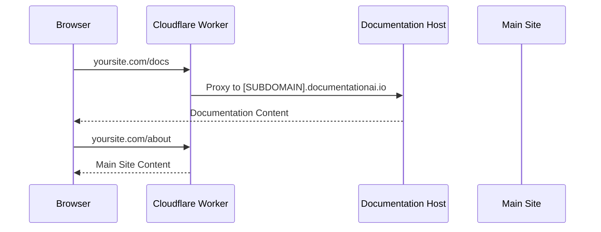

## Overview

Use Cloudflare Workers to host your documentation at a custom subpath like `yoursite.com/docs`. Workers act as a reverse proxy, routing documentation requests to your Documentation.AI hosting while keeping your main site intact.

<Callout kind="info">
  **Prerequisites:**
  - Cloudflare account
  - Domain added to Cloudflare (or using Cloudflare DNS)
  - Documentation accessible at <kbd>[SUBDOMAIN].documentationai.io</kbd>
</Callout>

## How It Works



The Worker intercepts all requests to your domain:
- Requests to `/docs` (or your chosen subpath) → Proxied to Documentation.AI
- All other requests → Passed through to your main site

## Step 1: Create Worker

<Steps>
  <Step title="Open Cloudflare Dashboard">
    Go to [Cloudflare Dashboard](https://dash.cloudflare.com/) → **Workers & Pages**.
  </Step>
  
  <Step title="Create New Worker">
    Click **Create application** → **Create Worker** → **Deploy**.
  </Step>
  
  <Step title="Name Your Worker">
    Give it a name like `docs-proxy` and click **Deploy**.
  </Step>
</Steps>

## Step 2: Configure Worker Script

<Steps>
  <Step title="Edit Worker Code">
    Click **Edit Code** to open the code editor.
  </Step>
  
  <Step title="Replace Default Code">
    Delete all existing code and paste the script below.
  </Step>
  
  <Step title="Update Configuration">
    Replace the placeholders with your actual values (see callout below).
  </Step>
</Steps>

<Callout kind="alert">
  **Required Replacements:**
  - <kbd>[SUBDOMAIN]</kbd> → Your Documentation.AI subdomain (e.g., <kbd>acme</kbd>)
  - <kbd>[YOUR_DOMAIN]</kbd> → Your domain (e.g., <kbd>yoursite.com</kbd>)
  - <kbd>/docs</kbd> → Your chosen subpath (e.g., <kbd>/docs</kbd>, <kbd>/help</kbd>, <kbd>/guide</kbd>)
</Callout>

### Worker Script

```javascript
addEventListener("fetch", (event) => {
  event.respondWith(handleRequest(event.request));
});

async function handleRequest(request) {
  try {
    const url = new URL(request.url);
    
    // Allow SSL verification paths to pass through
    if (url.pathname.startsWith('/.well-known/')) {
      return await fetch(request);
    }
    
    // Route documentation requests to Documentation.AI
    // Change /docs to your chosen subpath (e.g., /help, /guide, /api-docs)
    if (url.pathname.startsWith('/docs')) {
      const DOCS_HOST = "[SUBDOMAIN].documentationai.io";
      const YOUR_DOMAIN = "[YOUR_DOMAIN]";
      
      // Update the URL to point to documentation host
      url.hostname = DOCS_HOST;
      
      // Create proxy request with proper headers
      const proxyRequest = new Request(url, request);
      proxyRequest.headers.set("Host", DOCS_HOST);
      proxyRequest.headers.set("X-Forwarded-Host", YOUR_DOMAIN);
      proxyRequest.headers.set("X-Forwarded-Proto", "https");
      
      return await fetch(proxyRequest);
    }
    
    // Pass all other requests to your main site
    return await fetch(request);
    
  } catch (error) {
    return new Response("Error: " + error.message, { status: 500 });
  }
}
```

<Callout kind="tip">
  **Using a Different Subpath?** Change <kbd>/docs</kbd> on line 17 to your chosen path. For example:
  - For <kbd>/help</kbd>: Change to <kbd>if (url.pathname.startsWith('/help'))</kbd>
  - For <kbd>/api-docs</kbd>: Change to <kbd>if (url.pathname.startsWith('/api-docs'))</kbd>
</Callout>

## Step 3: Deploy Worker

<Steps>
  <Step title="Save and Deploy">
    Click **Save and Deploy** in the top-right corner.
  </Step>
  
  <Step title="Test Worker URL">
    Copy your Worker URL (shown as `your-worker.your-subdomain.workers.dev`).
  </Step>
  
  <Step title="Test Documentation">
    Visit `your-worker.your-subdomain.workers.dev/docs` to verify it loads your documentation.
  </Step>
</Steps>

## Step 4: Connect Your Domain

<Steps>
  <Step title="Add Custom Domain">
    In the Worker page, go to **Settings** → **Triggers** → **Add Custom Domain**.
  </Step>
  
  <Step title="Enter Your Domain">
    Enter your domain (e.g., `yoursite.com`) and click **Add Custom Domain**.
  </Step>
  
  <Step title="Add WWW Subdomain">
    Repeat to add `www.yoursite.com` if you use the www subdomain.
  </Step>
</Steps>

<Callout kind="info">
  If you already have DNS records pointing to your main site, Cloudflare will automatically route traffic through your Worker. No DNS changes needed!
</Callout>

## Step 5: Test Your Setup

<Steps>
  <Step title="Test Documentation">
    Visit `yoursite.com/docs` (or your chosen subpath) - should show documentation.
  </Step>
  
  <Step title="Test Main Site">
    Visit `yoursite.com` - should show your main site.
  </Step>
  
  <Step title="Test Nested Pages">
    Visit `yoursite.com/docs/any-page` - should show documentation pages.
  </Step>
  
  <Step title="Check Browser Console">
    Open DevTools → Console - should have no errors.
  </Step>
</Steps>

<Callout kind="success">
  ✅ Your documentation is now live at your custom subpath!
</Callout>

## Advanced: Webflow Integration

If your main site is hosted on Webflow, you need to route non-docs traffic to your Webflow landing page. Add this configuration to your Worker script:

```javascript
// Add after line 27 (after the /docs routing)

// Route all other traffic to Webflow landing page
const WEBFLOW_LANDING = "landing.yoursite.webflow.io";
const mainSiteUrl = new URL(request.url);
mainSiteUrl.hostname = WEBFLOW_LANDING;

return await fetch(mainSiteUrl, {
  method: request.method,
  headers: request.headers,
  body: request.body
});
```

<Callout kind="alert">
  Replace <kbd>landing.yoursite.webflow.io</kbd> with your actual Webflow landing page domain.
</Callout>

## Troubleshooting

<ExpandableGroup>
  <Expandable title="Documentation Shows 404">
    **Problem:** `yoursite.com/docs` returns 404.

    **Solutions:**
    1. Verify Worker is deployed (check Workers dashboard)
    2. Confirm `[SUBDOMAIN]` matches your actual subdomain
    3. Test Worker URL directly: `your-worker.workers.dev/docs`
    4. Check custom domain is added in Worker settings
  </Expandable>

  <Expandable title="Main Site Not Working">
    **Problem:** Main site broken after adding Worker.

    **Solutions:**
    1. Ensure Worker only intercepts `/docs` requests
    2. Check that `return await fetch(request)` is present for non-docs traffic
    3. Verify DNS records for main site still exist
  </Expandable>

  <Expandable title="SSL Certificate Errors">
    **Problem:** Browser shows SSL warnings.

    **Solutions:**
    1. Wait 24 hours for SSL certificate provisioning
    2. Verify Universal SSL is enabled in Cloudflare dashboard
    3. Check that `.well-known/*` paths are not blocked in Worker
  </Expandable>

  <Expandable title="Worker Not Intercepting Requests">
    **Problem:** Worker doesn't seem to run.

    **Solutions:**
    1. Confirm custom domain is added to Worker
    2. Check Worker routes in **Triggers** tab
    3. Verify Worker is deployed (status should show "Active")
    4. Clear browser cache and try again
  </Expandable>
</ExpandableGroup>

## Configuration Reference

### Key Headers

| Header | Value | Purpose |
|--------|-------|---------|
| `Host` | `[SUBDOMAIN].documentationai.io` | Tell documentation host which site to serve |
| `X-Forwarded-Host` | `yoursite.com` | Preserve original domain for analytics |
| `X-Forwarded-Proto` | `https` | Ensure secure connections |

### Path Handling

| Path | Action | Destination |
|------|--------|-------------|
| `/.well-known/*` | Pass through | Original request (for SSL verification) |
| `/docs/*` | Proxy | Documentation.AI hosting |
| All others | Pass through | Your main site |

## Next Steps

- Monitor Worker performance in Cloudflare Dashboard
- Set up analytics to track documentation traffic
- Configure custom error pages if needed
- Test from different locations to verify global performance

<Callout kind="tip">
  Cloudflare Workers run at 300+ data centers worldwide, providing fast response times globally.
</Callout>
