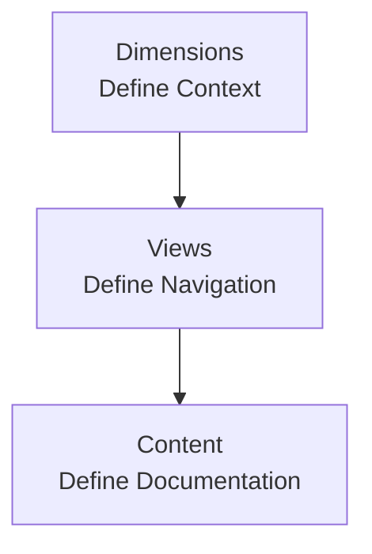

## Overview

Dimensions are top-level context selectors that split your documentation into parallel variants. They define _where_ a reader is in your docs: which product, version, or language they are viewing.

Dimensions sit at the top of your navigation architecture:

- **Dimensions** define the context (for example, Product A / v2 / English).
- **Views** define how navigation is presented within that context (tabs, groups, dropdowns).
- **Content** is the actual pages and groups that readers see.

Use this page when you are designing or changing your navigation model, especially before adding products, versions, or languages.

<Callout kind="info">

Dimensions are configured at the site level (see [Site Configuration](/customize/site-configuration)) and then used in the Web Editor and Code Editor to organize views and content.

</Callout>

## When to use dimensions

Dimensions are powerful, but you should only add them when your docs truly exist in parallel variants.

### Good use cases

Use a dimension when **the same conceptual docs exist in multiple versions**, and you want readers to switch between them globally:

- **Products**  
  - You have multiple related products with mostly parallel docs (for example, "Cloud", "On‑prem").
  - You want a top-level product selector that changes the entire navigation.

- **Versions**  
  - You maintain multiple active product or API versions (for example, `v1` and `v2`).
  - Readers often need to switch versions while staying on the same topic.

- **Languages**  
  - You provide full or near-full translations (for example, "English" and "Español").
  - You want a language selector that changes all pages, not just a subset.

In the published docs, dimensions appear as dropdown selectors near the top of the site.

### When *not* to use dimensions

Do **not** use dimensions for every variation or audience. Prefer standard navigation (groups, pages, tabs) when:

- Only a few pages differ per version or product.
- You are targeting audiences (for example, Admin vs Developer) that share most content but need different entry points.
- You just need a small number of platform-specific notes or code samples.

In these cases, use:

- [Tabs](/components/tabs) within a single page (for example, "JavaScript / Python").
- Separate groups in your navigation (for example, "Admin Guide" and "Developer Guide").
- [Callout](/components/callout) blocks to highlight role-specific details.

<Callout kind="tip">

Start with **no dimensions**. Add a dimension only after you can clearly name the variants and you expect them to stay in place for a while (for example, long‑lived versions or products).

</Callout>

## How dimensions interact with views and content

Dimensions are the outermost layer. Once a reader selects values for all active dimensions (for example, Product B / v2 / English), they see a navigation tree that is specific to that context.

### Dimensions → views

Within each dimension combination, you define **views**:

- Views control sidebar organization (groups, tabs, dropdowns).
- Each view lives **inside** a single dimension context.
- You can reuse patterns across contexts (for example, each product has `Getting Started`, `Guides`, `API Reference` groups), but the structure is configured independently.

Examples of view-level elements:

- Groups such as "Getting Started", "API Documentation".
- Tabs used for navigation sections.
- Dropdowns that introduce another navigation level.

### Views → content

Within a view, you attach **content**:

- Pages (`*.mdx` files or Web Editor pages).
- Nested groups of pages.
- API reference sections from imported OpenAPI schemas.

The same conceptual page can appear in:

- Multiple dimension contexts (for example, a shared FAQ reused across products).
- Different views within a dimension (for example, a "Quickstart" linked from both "Overview" and "API Reference").

### Constraints and the one-child rule

Navigation inside a dimension still follows the normal structural rules from the Web Editor:

- Each container has **exactly one child type**.
  - A tab can contain **pages** _or_ **groups** _or_ **dropdowns**.
  - A dropdown can contain **pages** _or_ **groups** _or_ **tabs** _or_ other dropdowns.
- The Editor and site configuration tools only show valid "Add ..." options at each level.

Dimensions do not change these rules; they simply scope which tree of containers and pages is active.

## Designing dimensions: guidelines and pitfalls

Use this section as a checklist when you plan or refactor dimensions.

<Steps>

  <Step title="Decide if you truly need a dimension" icon="help-circle">

  - List your current and planned variants (products, versions, languages).
  - Ask whether readers must **switch context globally**, or if a few local differences are enough.
  - If most content is shared and differences are small or short‑lived, avoid adding a dimension.

  </Step>

  <Step title="Choose a single root dimension" icon="arrow-right">

  - Your navigation must start with one dimension type at the root level.
  - Typical root choices:
    - Product → then Version → then Language
    - Product → then Language
    - Version only (for a single product with multiple API versions)
  - Pick the root based on what users think about **first** when arriving at your docs.

  </Step>

  <Step title="Keep the number of dimensions small" icon="settings">

  - Most sites work well with **one or two** dimensions.
  - Three dimensions (Product + Version + Language) are possible but more complex to maintain.
  - If your matrix of combinations starts to feel large or sparse, reconsider whether you can:
    - Drop a dimension.
    - Represent some variation inside pages (tabs, callouts).
    - Merge rarely used variants.

  </Step>

  <Step title="Align views across variants where it helps" icon="columns-3">

  - Within a dimension, keep major groups consistent:
    - Use the same group names and order where possible.
    - Mirror key entry points (for example, "Quickstart", "API Reference").
  - This makes it easy for readers to switch product or version and stay oriented.

  </Step>

  <Step title="Plan for lifecycle changes" icon="clock">

  - Versions and some products eventually deprecate.
  - Decide ahead of time how you will:
    - Mark older variants as legacy or deprecated.
    - Hide or demote variants once usage is low.
    - Redirect readers from removed variants to supported ones.
  - Keep at least one clearly marked "current" path to reduce confusion.

  </Step>

</Steps>

### Common pitfalls

Avoid these patterns when designing dimensions:

- **Over‑segmenting**  
  Creating dimensions for every role, plan, or platform when a single docs tree with tabs and callouts would be simpler.

- **Uneven variants**  
  Having many pages in one variant and only a few in another, leaving large gaps or empty navigation states.

- **Frequent reconfiguration**  
  Changing dimension types or order often. This makes URLs, bookmarks, and mental models unstable for readers.

- **Deep nesting with many dimensions**  
  Combining several dimensions with heavily nested views. This is hard to reason about and maintain for both humans and AI agents.

<Callout kind="danger">

Before adding or changing dimensions, map a few **end-to-end user journeys** (for example, "New API user for Product B / v2 / English") and confirm they can find key pages with minimal context switching.

</Callout>

### Related reading

- [Organize overview](/organize/overview) for how dimensions fit into the broader organization features.
- [Site Configuration](/customize/site-configuration) for configuring dimensions, views, and content in code.
- [Organize content and navigation in the Web Editor](/write-and-publish/web-editor/organize) for editor-based navigation management.