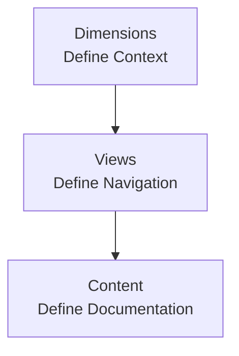

## Overview

Dimensions are top-level context selectors that split your documentation into parallel variants. They define *where* a reader is in your docs: which product, version, or language they are viewing.

Dimensions sit at the top of your navigation architecture:

- **Dimensions** define the context (for example, Product A / v2 / English).

- **Views** define how navigation is presented within that context (tabs, groups, dropdowns).

- **Content** is the actual pages and groups that readers see.

Dimensions are the **top layer** of the navigation structure. A project can have **multiple dimensions** (for example, Product + Version + Language), but most sites work best with one or two.

You can manage Dimensions in:

- **Web Editor** (Navigation panel) for UI-based setup and everyday edits

- **documentation.json** (Site Configuration) for file-based setup and bulk changes (via Code Editor)

See [Site Configuration](/customize/site-configuration) for file-based management: `/customize/site-configuration`.

## When to use dimensions

Dimensions are powerful, but you should only add them when your docs truly exist in parallel variants.

### Good use cases

Use a dimension only when your docs truly exist in parallel variants and readers need to switch context globally.

**Good use cases:**

- Products (Cloud vs On-prem) with mostly parallel docs

- Versions (v1 vs v2) where users frequently switch versions

- Languages (English vs Español) where most pages are translated

**Avoid dimensions when:**

- Only a few pages differ across variants

- Differences are audience-based (Admin vs Developer) rather than true variants

- Variation can be handled inside pages (tabs, callouts) or with groups/views

<Callout kind="tip" collapsed="false">
  Start with no dimensions. Add a dimension only once the variants are stable and long-lived.
</Callout>

## How dimensions interact with views and content

**Dimensions → Views (optional) → Content**

Once a reader selects values for all active dimensions, they see the navigation tree for that context. From there, your structure can go in either direction:

- **Dimensions → Views → Content**\
  Use Views (Tabs/Dropdowns) when you need layout and navigation structure inside a dimension.

- **Dimensions → Content**\
  Views are not required. You can place content directly under a dimension branch (for example, a flat list of pages, or groups/pages without tabs or dropdowns).

In all cases, the same structural constraints apply within a branch (including the one-child rule).

## Working with Dimensions in the Web Editor

In the Web Editor, Dimensions are managed from the **Navigation** panel. Dimensions can be added either as a **parent** layer (wrapping what currently exists) or as a **child** layer (nesting a new dimension inside an existing one).

### Before you start: confirm what’s currently at the top

Open **Editor → Navigation** and check what your current top layer is:

- If you see **Dimension selectors** (Product/Version/Language), Dimensions already exist.

  <Image src="https://blob-cdn.documentation.ai/org-53a37986-2c9e-4094-b9e8-1e1ffae9e9ee/doc-b389b141-ae58-4fd5-91f9-6702fae9ac58/1767162223934-ci9oh33122u-pasted-image-1767162220924.png?q=85&fm=auto&auto=compress%2Cformat" width="396" height="303" alt="Web editor view with 'Dimension' already added" caption="Web editor view with 'Dimension' already added" style="width: 396px; height: auto; cursor: pointer; margin: 0 auto;" />

* If you see **Tabs/Dropdowns** first, your top layer is a View.

  <Image src="https://blob-cdn.documentation.ai/org-53a37986-2c9e-4094-b9e8-1e1ffae9e9ee/doc-b389b141-ae58-4fd5-91f9-6702fae9ac58/1767162713331-jx2dp19rez-pasted-image-1767162711033.png?q=85&fm=auto&auto=compress%2Cformat" width="385" height="275" alt="Web editor view without 'Dimensions'" caption="Web editor view without 'Dimensions'" style="width: 385px; height: auto; cursor: pointer; margin: 0 auto;" />

* If you see only **Groups** or **Pages**, your structure is currently flat content (no Views or Dimensions yet).

### Add a Dimension

You can add a Dimension in two ways:

### A) Add a Dimension as a parent (wrap the existing top layer)

Use this to add a Dimension above whatever currently exists at the top—an existing **Dimension**, a **View** (Tabs/Dropdowns), or a **flat content** structure (Groups/Pages).

Steps:

1. In the sidebar navigation area, hover over the **top-left** of the current top layer header (the topmost layer you see—Dimension/View/Groups/Pages).

2. Click the **top&#x20;**<kbd>+</kbd>**&#xA0;**&#x69;con (Add Parent layer).

   <Image src="https://blob-cdn.documentation.ai/org-53a37986-2c9e-4094-b9e8-1e1ffae9e9ee/doc-b389b141-ae58-4fd5-91f9-6702fae9ac58/1767163463253-1556o742oze-pasted-image-1767163460529.png?q=85&fm=auto&auto=compress%2Cformat" width="1600" height="524" alt="Adding 'Dimension' as a parent to flat structure & tab view" caption="Adding 'Dimension' as a parent to flat structure & tab view" />

3. Choose **Add Dimension**, then select the dimension type (Product / Version / Language).

4. Create the first value (for example, `Cloud`, `v1.0`, or `English`) and save.

What happens:

- The Editor wraps your existing structure inside the new Dimension.

- Your existing navigation/content is moved under the first value of that Dimension.

- You can add additional values as siblings (for example, `v2.0`) and configure each branch independently.

### B) Add a Dimension as a child (nest inside an existing Dimension)

Use this when you already have one Dimension (for example, Product) and want to add another Dimension under it (for example, Version).

Steps:

1. Hover on the existing Dimension value you want to nest under (for example, **Version: v1.0**).

2. Click the **bottom&#x20;**<kbd>+</kbd>**&#xA0;**&#x69;con (Add Child layer).

   <Image src="https://blob-cdn.documentation.ai/org-53a37986-2c9e-4094-b9e8-1e1ffae9e9ee/doc-b389b141-ae58-4fd5-91f9-6702fae9ac58/1767163792890-fx8uu5amqq4-pasted-image-1767163790528.png?q=85&fm=auto&auto=compress%2Cformat" width="1600" height="570" alt="Adding 'Dimension' as a child layer to another dimension" caption="Adding 'Dimension' as a child layer to another dimension" />

3. Choose **Add Child Dimension**, then select the dimension type (Product / Version / Language).

4. Create the first value (for example, `Product A`) and save.

What happens:

- The Editor inserts a new child Dimension under the selected Dimension value.

- All existing content under that Dimension value is moved under the first value of the new child Dimension.

- You can create sibling values for the new child Dimension (for example, `Product B`) and then customize or distribute content per value.

### Add and manage Dimension values

After a Dimension exists, you can maintain it from the Dimension selector area:

- Add more values (for example, add `v2.0` next to `v1.0`).

- Switch between values to edit the Views and content under each branch.

- Rename values to match your naming conventions (for example, `v1` → `v1.0`).

- Reorder values so the default or recommended option appears first.

- Remove or hide values when a variant is deprecated (plan redirects if URLs will change).

Tip: After creating new values, switch between them immediately to confirm you’re editing the correct branch and that navigation/content appears where you expect.

## Managing Dimensions in configuration (documentation.json)

For file-based management, configure Dimensions in `documentation.json` using Site Configuration. This is useful when you want:

- Version-controlled navigation changes

- Bulk edits across many dimension branches

- Structured review in pull requests

See [Site Configuration](/customize/site-configuration) to manage it via the Code Editor.

## Designing dimensions: guidelines and pitfalls

Use this section as a checklist when you plan or refactor dimensions.

<Steps>
  <Step title="Decide if you truly need a dimension" icon="help-circle" title-type="p">
    - List your current and planned variants (products, versions, languages).

    - Ask whether readers must **switch context globally**, or if a few local differences are enough.

    - If most content is shared and differences are small or short‑lived, avoid adding a dimension.
  </Step>

  <Step title="Choose a single root dimension" icon="arrow-right" title-type="p">
    - Your navigation must start with one dimension type at the root level.

    - Typical root choices:

      - Product → then Version → then Language

      - Product → then Language

      - Version only (for a single product with multiple API versions)

    - Pick the root based on what users think about **first** when arriving at your docs.
  </Step>

  <Step title="Keep the number of dimensions small" icon="settings" title-type="p">
    - Most sites work well with **one or two** dimensions.

    - Three dimensions (Product + Version + Language) are possible but more complex to maintain.

    - If your matrix of combinations starts to feel large or sparse, reconsider whether you can:

      - Drop a dimension.

      - Represent some variation inside pages (tabs, callouts).

      - Merge rarely used variants.
  </Step>

  <Step title="Align views across variants where it helps" icon="columns-3" title-type="p">
    - Within a dimension, keep major groups consistent:

      - Use the same group names and order where possible.

      - Mirror key entry points (for example, "Quickstart", "API Reference").

    - This makes it easy for readers to switch product or version and stay oriented.
  </Step>

  <Step title="Plan for lifecycle changes" icon="clock" title-type="p">
    - Versions and some products eventually deprecate.

    - Decide ahead of time how you will:

      - Mark older variants as legacy or deprecated.

      - Hide or demote variants once usage is low.

      - Redirect readers from removed variants to supported ones.

    - Keep at least one clearly marked "current" path to reduce confusion.
  </Step>
</Steps>

### Common pitfalls

Avoid these patterns when designing dimensions:

- **Over‑segmenting**\
  Creating dimensions for every role, plan, or platform when a single docs tree with tabs and callouts would be simpler.

- **Uneven variants**\
  Having many pages in one variant and only a few in another, leaving large gaps or empty navigation states.

- **Frequent reconfiguration**\
  Changing dimension types or order often. This makes URLs, bookmarks, and mental models unstable for readers.

- **Deep nesting with many dimensions**\
  Combining several dimensions with heavily nested views. This is hard to reason about and maintain for both humans and AI agents.

<Callout kind="danger" collapsed="false">
  Before adding or changing dimensions, map a few **end-to-end user journeys** (for example, "New API user for Product B / v2 / English") and confirm they can find key pages with minimal context switching.
</Callout>

### Related reading

- [Organize overview](/organize/overview) for how dimensions fit into the broader organization features.

- [Site Configuration](/customize/site-configuration) for configuring dimensions, views, and content in code.

- [Organize content and navigation in the Web Editor](/write-and-publish/web-editor/organize) for editor-based navigation management.

