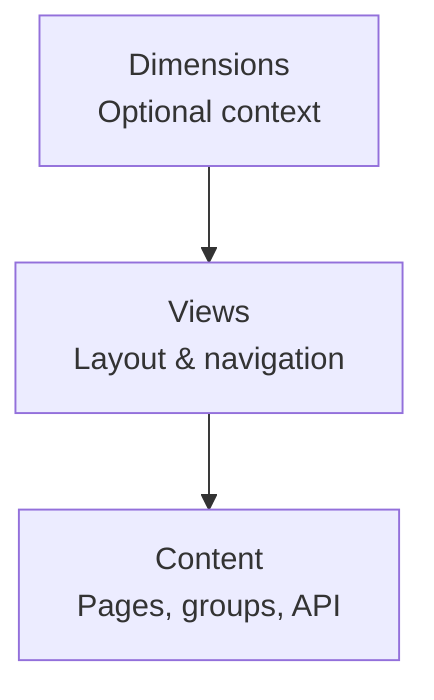

## Why organization matters

Good content is not enough if people cannot find it.

In Documentation.AI, navigation is a first-class concern for both human readers and AI agents. A clear organizing model helps you:

- Avoid duplicated sections and hard-to-maintain sidebars
- Plan for product growth, versions, and languages
- Keep navigation consistent across Web Editor and code-based workflows
- Give AI features a predictable map of your docs

This page introduces the core organizing model and points you to the detailed guides for [dimensions](/organize/dimensions), [views](/organize/views), [groups](/organize/groups), [pages](/organize/pages), and API-specific structure.

<Callout kind="info">

If you work primarily from the code editor, also review [Code Editor](/write-and-publish/code-editor) to see how the same concepts map to `documentation.json`.

</Callout>

## The core model: Dimensions → Views → Content

Documentation.AI uses a three-layer navigation architecture:



At a high level:

1. **Dimensions** (optional) define _where_ the reader is (for example, product, version, language).
2. **Views** define _how_ navigation is arranged in that context (tabs and dropdowns).
3. **Content** defines _what_ the reader can read (pages, groups, API references).

You can:

- Use **Views + Content** only, with **no Dimensions**, for simple sites.
- Add one or more **Dimensions** when you need parallel variants of the docs that readers can switch between globally.

### Dimensions: define context (optional outer layer)

Dimensions are top-level context selectors that split docs into parallel variants and define where a reader is.

Use dimensions when you need parallel sets of docs that share structure but differ in content. For example:

- Product A vs. Product B
- Stable vs. Beta versions
- English vs. Spanish

Key rules:

- Dimensions are **always the outermost layer** in your structure.
- A project can have **zero, one, or multiple dimensions**, but most sites work best with one or two.
- Dimensions can map directly to content, or to views that then organize content:  
  `Dimensions → Views → Content` or `Dimensions → Content`.

See [Dimensions](/organize/dimensions) for examples and design patterns.

### Views: define navigation and layout

Views control how content is organized and navigated **within a dimension context**, or **at the root** when you do not use dimensions.

Views answer:

- Which high-level areas are visible at once?
- Do I switch between areas via **tabs** or a **dropdown**?
- How does the sidebar change when I change the view?

Supported view types:

- **Tabs**: horizontal tabs for mutually exclusive areas (for example, Guides vs. API).
- **Dropdowns**: a select-style control for modes or profiles (for example, Cloud vs. Self-hosted).

Views:

- Never create new content; they **only arrange content**.
- **Never contain dimensions** (dimensions are always outside views).
- Always sit between the outer context (dimension or root) and the content they expose.

See [Views](/organize/views) for supported nesting patterns and visual examples.

### Content: groups, pages, and API reference

The content layer is what readers actually consume:

- **Pages**: MDX-backed units with unique `path` values (slugs).  
  See [Pages](/organize/pages) for how paths work and how to move or rename pages safely.
- **Groups**: sidebar sections that collect related pages (and nested groups).  
  See [Groups](/organize/groups) for grouping strategies and rules.
- **API-backed sections**: OpenAPI- or schema-driven API references and playgrounds.  
  See [Organize API Reference](/api-documentation-and-playground/organize-api-reference) and [OpenAPI / JSON Schema Import](/api-documentation-and-playground/openapi-import).

You shape content structure using **parent/child relationships** (groups that contain pages, nested groups, or API sections) while views determine when and where that structure appears.

## Key structure rules to remember

This section summarizes the most important constraints from the detailed reference pages so you can design a valid structure up front.

### Dimensions and views

- **Dimensions are optional but always outermost**  
  If you use dimensions, the order is always: `Dimensions → Views (optional) → Content`.
- **Views never contain dimensions**  
  You cannot add dimensions inside a tab or dropdown; a view always lives _inside_ a dimension context or at the root.

For deeper rules and examples, see [Dimensions](/organize/dimensions) and [Views](/organize/views).

### The one-child rule for containers (views)

Views obey a strict one-child rule:

- **Tabs** can contain exactly one child type:
  - `Pages` **or**
  - `Groups` **or**
  - `Dropdowns`
- **Dropdowns** can contain exactly one child type:
  - `Pages` **or**
  - `Groups` **or**
  - `Tabs` **or**
  - `Dropdowns`

You cannot mix different child types at the same level inside a single tabs or dropdowns container.

See [Views](/organize/views) for diagrams of valid and invalid combinations.

### Groups and pages

From the [Groups](/organize/groups) and [Pages](/organize/pages) guides:

- **Groups** are sidebar sections
  - Once you introduce groups at a level, **treat that level as “grouped”**.
  - Groups can contain pages, nested groups, and API/OpenAPI-backed sections.
- **Avoid mixing grouped and ungrouped content** at the same level
  - Choose either:
    - A flat list of pages, or
    - Only groups (each group then contains pages or nested groups).
- **Pages** are the fundamental content units
  - The stable identifier is the page **`path` (slug)**, which becomes part of the URL.
  - Reference `path` values **without** the `.mdx` extension.
  - Prefer moving pages between groups over renaming their paths; if you change a slug, add a redirect.

## A practical planning workflow

When you plan or refactor a docs set, work from the outside in.

<Steps>

  <Step title="Decide if you need dimensions" icon="layers">

  Decide which axes of variation are real, not just labels.

  - Start with product, version, and language.
  - Only add a dimension if it meaningfully changes content across many pages.
  - Most sites are either:
    - No dimensions (single product, single language), or
    - One dimension for versions or deployment models.

  </Step>

  <Step title="Design views for navigation" icon="layout-dashboard">

  Within each dimension context (or at the root), decide how people move around.

  - Use tabs for big, mutually exclusive areas (for example, "Guides" vs. "API").
  - Use dropdowns where the choice feels like a mode or profile (for example, "Cloud" vs. "Self-hosted").
  - Apply the one-child rule: each tabs or dropdowns container uses a single child type.

  </Step>

  <Step title="Shape groups, pages, and API sections" icon="folder-tree">

  Once views are defined, structure the actual docs.

  - Create groups for logical sections (for example, "Getting Started", "Advanced Topics").
  - At each sidebar level, choose either all pages or all groups (plus their children), not a mix.
  - Add API/OpenAPI-backed sections alongside pages in groups when needed.

  </Step>

  <Step title="Validate with real journeys" icon="users">

  Before publishing, test with real workflows.

  - Trace key user journeys: onboarding, first integration, troubleshooting, API evaluation.
  - Ensure each journey has a straightforward path with minimal context switches.
  - If journeys require frequent dimension or view changes, simplify your structure.

  </Step>

</Steps>

This outside-in approach keeps your organizing decisions deliberate and prevents ad hoc sidebars over time.

## Example structures for common docs types

This section gives you three lightweight patterns you can adapt. Each shows the structural idea, not the full configuration.

### 1. Simple product docs with tabs (no dimensions)

Use this when you have a single product and language, and you want a clear split between narrative guides and API reference.

**Structure (conceptual):**

```text
Root (no dimensions)
└─ Views: Tabs
   ├─ Tab: Guides
   │  └─ Groups
   │     ├─ Getting Started
   │     │  ├─ Introduction
   │     │  └─ Quickstart
   │     └─ How-to Guides
   └─ Tab: API
      └─ Groups
         ├─ Authentication
         └─ API Reference (OpenAPI-backed)
```

**When to use**

- You do not need product, version, or language switching at the top level.
- You want a stable Guides vs. API split that aligns with common reader expectations.
- You can keep the number of tabs small (usually 2–3).

Relevant deep dives:

- [Views](/organize/views) for tabs configuration and the one-child rule
- [Groups](/organize/groups) and [Pages](/organize/pages) for shaping the Guides sidebar
- [Organize API Reference](/api-documentation-and-playground/organize-api-reference) for the API tab

### 2. Versioned docs using a version dimension

Use this when you maintain multiple live versions (for example, `v1`, `v2`, `Beta`) that differ meaningfully in content.

**Structure (conceptual):**

```text
Dimension: Version
├─ Value: v1
│  └─ Views (optional) or Content
│     └─ Groups
│        ├─ Getting Started
│        └─ API Reference (v1)
└─ Value: v2
   └─ Views (optional) or Content
      └─ Groups
         ├─ Getting Started
         └─ API Reference (v2)
```

You can:

- Reuse the same group and page structure across versions.
- Vary content per version while keeping navigation familiar.

**When to use**

- Content differences by version are substantial (not just a few small notes).
- Readers must know which version they are in at all times.
- You want a top-level switcher for version context.

Relevant deep dives:

- [Dimensions](/organize/dimensions) for modeling version context
- [Groups](/organize/groups) for mirroring structure across versions
- [Organize API Reference](/api-documentation-and-playground/organize-api-reference) and [OpenAPI / JSON Schema Import](/api-documentation-and-playground/openapi-import) for versioned API definitions

### 3. API-heavy docs with dropdowns and grouped reference

Use this when your primary surface is the API, possibly with multiple products, deployment models, or platforms.

**Structure (conceptual):**

```text
Root (or inside a Dimension)
└─ Views: Dropdown (for mode)
   ├─ Option: Cloud
   │  └─ Tabs
   │     ├─ Guides
   │     │  └─ Groups
   │     │     ├─ Getting Started
   │     │     └─ Integration Guides
   │     └─ API
   │        └─ Groups
   │           ├─ Authentication
   │           └─ OpenAPI-backed Reference
   └─ Option: Self-hosted
      └─ Tabs (mirrors Cloud, with self-hosted specifics)
```

**When to use**

- You need a clear separation between deployment models, platforms, or profiles (for example, public vs. partner APIs).
- API reference is large enough that you want:
  - A dedicated API area (tab), and
  - Careful grouping within that area (by resource, domain, or team).
- You plan to import or sync schemas for a large API surface.

Relevant deep dives:

- [Views](/organize/views) for combining dropdowns and tabs in a valid way
- [Groups](/organize/groups) for structuring a large API sidebar
- [Organize API Reference](/api-documentation-and-playground/organize-api-reference) and [OpenAPI / JSON Schema Import](/api-documentation-and-playground/openapi-import) for schema-driven reference

## Choose your next step

Use this section to jump into the right detailed guide, depending on what you are planning now.

<Columns cols={2}>

  <Card title="Dimensions" href="/organize/dimensions" icon="layers" cta="Plan products, versions, and languages">

  Learn when to introduce product, version, or language dimensions and how they relate to views and content, so your structure can scale without duplication.

  </Card>

  <Card title="Views" href="/organize/views" icon="layout-dashboard" cta="Design tabs and dropdowns">

  Understand how to define views (tabs and dropdowns), supported nesting patterns, and the one-child rule for clean, predictable navigation.

  </Card>

</Columns>

<Columns cols={2}>

  <Card title="Groups" href="/organize/groups" icon="folder-tree" cta="Shape the sidebar">

  See how to use groups as sidebar sections, what they can contain, and patterns for keeping long sidebars scannable and maintainable.

  </Card>

  <Card title="Pages" href="/organize/pages" icon="file-text" cta="Manage page units and paths">

  Learn how pages work as MDX-backed units, how paths and slugs are referenced, and how to rename or move pages safely.

  </Card>

</Columns>

## Best practices

### What usually works well

- **Start with context, not sidebars**  
  Decide whether you need dimensions (product, version, language) before tuning view and group structure.

- **Favor stable top-level choices**  
  Once you add a tab, dropdown, or dimension value, keep it stable so links and AI references stay valid.

- **Keep hierarchies shallow**  
  Aim for 2–3 levels deep: dimension (optional) → view → group → pages or API sections.

- **Reuse patterns across dimensions**  
  Mirror the same group and page structure across versions or languages whenever possible.

- **Name for search and scanability**  
  Use concise, descriptive titles that work in search results and sidebars.

### Common anti-patterns to avoid

- **Using dimensions for cosmetic labels**  
  Do not add a dimension if the content is identical or only slightly different; use a section, group, or callout instead.

- **Breaking the one-child rule in views**  
  Do not mix pages, groups, tabs, and dropdowns inside a single tabs or dropdowns container.

- **Mixing grouped and ungrouped content**  
  Avoid sidebars where some items at a level are loose pages and others are groups; pick one mode per level.

- **Too many top-level views**  
  A long row of tabs or nested dropdowns makes navigation harder, not easier.

- **Frequent path renames without redirects**  
  Changing page paths often can break links and confuse users; plan structure early and evolve it carefully, using redirects when needed.