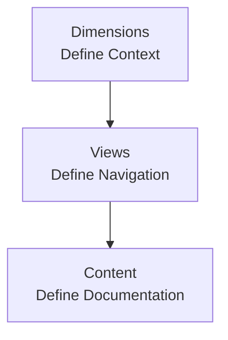

## Why organization matters

Good content is not enough if people cannot find it.

In Documentation.AI, navigation is a first-class concern for both human readers and AI agents. A clear organizing model helps you:

- Avoid duplicated sections and hard-to-maintain sidebars
- Plan for product growth, versions, and languages
- Keep navigation consistent across Web Editor and code-based workflows
- Give AI features a predictable map of your docs

This page introduces the core organizing model and points you to the detailed guides for dimensions, views, groups, and pages.

<Callout kind="info">

If you work primarily from the code editor, also review [Organize Content Structure](/write-and-publish/code-editor/organize) to see how the same concepts map to `documentation.json`.

</Callout>

## The core model: Dimensions → Views → Content

Documentation.AI uses a three-layer navigation architecture:

At a high level:

1. **Dimensions** define _where_ the reader is.
2. **Views** define _how_ navigation is arranged in that context.
3. **Content** defines _what_ the reader can read.

### Dimensions: define context

Dimensions answer questions like:

- Which **product** am I looking at?
- Which **version** is this page for?
- Which **language** or **framework** applies?

Use dimensions when you need parallel sets of docs that share structure but differ in content. For example:

- Product A vs. Product B
- Stable vs. Beta versions
- English vs. Spanish

Dimensions give you a consistent frame so that views and content can be reused or aligned across contexts.

### Views: define navigation

Views control how your docs are presented within a dimension context. They answer:

- Which high-level areas are visible at once?
- Do I switch between areas via **tabs** or **dropdowns**?
- How does the sidebar change when I change the view?

Common patterns:

- Top-level tabs for major areas like "Product Guides" and "API"
- A dropdown to select a product or deployment model
- Separate views for "Cloud" vs. "Self-hosted" with their own sidebars

Views do not create new content; they organize which content is visible and how users move between sections.

### Content: define documentation

The content layer is what readers actually consume:

- **Pages**: Markdown/MDX-backed units with unique paths
- **Groups**: Sidebar sections that collect related pages
- **API references** and other structured content types

You shape content structure using **parent/child relationships** (for example, a group containing several pages) while views determine how those structures appear in navigation.

## A practical mental model

When you plan or refactor a docs set, work from the outside in:

<Steps>

  <Step title="Choose your dimensions" icon="layers">

  Decide which axes of variation are real, not just labels.

  - Start with product, version, and language.
  - Only add a dimension if it meaningfully changes content.
  - Prefer fewer dimensions with clear values over many overlapping switches.

  </Step>

  <Step title="Design navigation views" icon="layout-dashboard">

  Within each dimension context, decide how people move around.

  - Use tabs for big, mutually exclusive areas (for example, "Guides" vs. "API").
  - Use dropdowns where the choice feels like a mode or profile (for example, "Cloud" vs. "Self-hosted").
  - Keep the number of top-level choices small and stable.

  </Step>

  <Step title="Shape sidebar groups and pages" icon="folder-tree">

  Once views are defined, structure the actual docs.

  - Create groups for logical sections (for example, "Getting Started", "Advanced Topics").
  - Use clear, action-oriented page titles.
  - Keep nesting shallow; avoid deeply nested hierarchies.

  </Step>

  <Step title="Validate with real journeys" icon="users">

  Before publishing, test with real workflows.

  - Trace key user journeys: onboarding, integration, troubleshooting.
  - Ensure every journey has a straightforward path with minimal view changes.
  - Adjust dimensions, views, groups, or page placement based on friction.

  </Step>

</Steps>

This approach keeps your organizing decisions deliberate instead of growing ad hoc sidebars over time.

## Choose your next step

Use this section to jump into the right detailed guide, depending on what you are planning now.

<Columns cols={2}>

  <Card title="Dimensions" href="/organize/dimensions" icon="layers" cta="Plan products, versions, and languages">

  Learn when to introduce product, version, or language dimensions and how they relate to views and content, so your structure can scale without duplication.

  </Card>

  <Card title="Views" href="/organize/views" icon="layout-dashboard" cta="Design tabs and dropdowns">

  Understand how to define views (tabs and dropdowns), supported nesting patterns, and the one-child rule for clean, predictable navigation.

  </Card>

</Columns>

<Columns cols={2}>

  <Card title="Groups" href="/organize/groups" icon="folder-tree" cta="Shape the sidebar">

  See how to use groups as sidebar sections, what they can contain, and patterns for keeping long sidebars scannable and maintainable.

  </Card>

  <Card title="Pages" href="/organize/pages" icon="file-text" cta="Manage page units and paths">

  Learn how pages work as MDX-backed units, how paths and slugs are referenced, and how to rename or move pages safely.

  </Card>

</Columns>

## Best practices

### What usually works well

- **Start with dimensions, not sidebars**  
  Decide context (product, version, language) before tuning group structure.

- **Favor stable top-level choices**  
  Once you add a tab or dropdown, keep it stable so links and AI references stay valid.

- **Keep hierarchies shallow**  
  Aim for 2–3 levels deep: view → group → pages. Deeper nesting increases cognitive load.

- **Reuse patterns across dimensions**  
  Mirror the same group and page structure across versions or languages whenever possible.

- **Name for search and scanability**  
  Use concise, descriptive titles that work in search results and sidebars.

### Common anti-patterns to avoid

- **Using dimensions for cosmetic labels**  
  Do not add a dimension if the content is identical or only slightly different; use a section or callout instead.

- **Too many top-level views**  
  A long row of tabs or multiple nested dropdowns makes navigation harder, not easier.

- **Overloading groups with mixed topics**  
  Avoid groups that contain unrelated pages just to keep the sidebar short.

- **Deep nesting instead of refactoring content**  
  If you find yourself adding a fourth or fifth nesting level, split content into clearer sections or new groups.

- **Frequent renames without redirects**  
  Changing page titles and paths often can break links and confuse users; plan structure early and evolve it carefully.