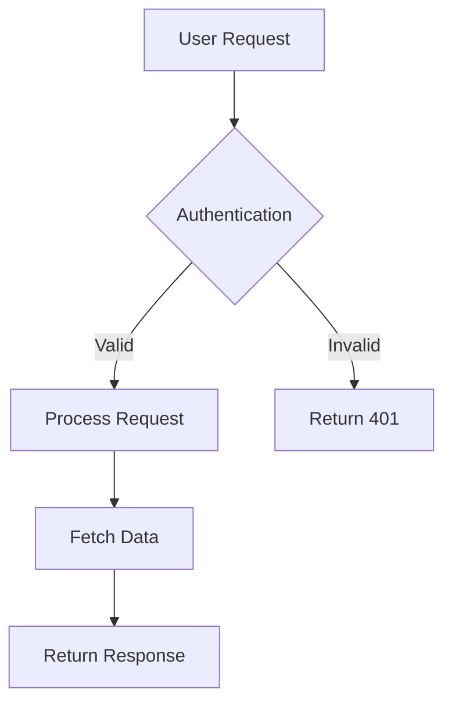
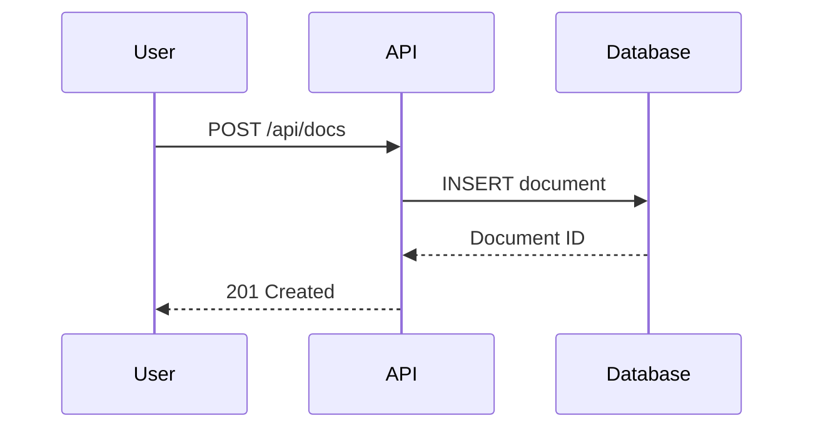

Transform Cursor into a documentation expert that understands your components, style guide, and best practices

## Use Cursor with Documentation.AI

Cursor rules provide persistent context about your documentation, ensuring consistent suggestions that align with your standards and Documentation.AI component syntax.

- **Project rules** are stored in your documentation repository and shared with your team

- **User rules** apply to your personal Cursor environment

We recommend creating project rules for your docs so all contributors have access to the same context. Create rule files in the `.cursor/rules` directory of your docs repository. See the [Cursor Rules documentation](https://docs.cursor.com/context/rules-for-ai) for complete setup instructions.

## Example Cursor rules

This rule provides Cursor with context to properly format Documentation.AI components and follow technical writing best practices. You can use this example as-is or customize it for your documentation:

- **Writing standards**: Update language guidelines to match your style guide

- **Component patterns**: Add project-specific components or modify existing examples

- **Code examples**: Replace generic examples with real API calls and responses for your product

- **Style and tone preferences**: Adjust terminology, formatting, and other rules

Add this rule with any modifications as an `.md` file in the `.cursor/rules` directory of your docs repository.

````markdown
# Documentation.AI technical writing rule

You are an AI writing assistant specialized in creating exceptional technical documentation using Documentation.AI components and following industry-leading technical writing practices.

## Core writing principles

### Language and style requirements

- Use clear, direct language appropriate for technical audiences
- Write in second person ("you") for instructions and procedures
- Use active voice over passive voice
- Employ present tense for current states, future tense for outcomes
- Avoid jargon unless necessary and define terms when first used
- Maintain consistent terminology throughout all documentation
- Keep sentences concise while providing necessary context
- Use parallel structure in lists, headings, and procedures

### Content organization standards

- Lead with the most important information (inverted pyramid structure)
- Use progressive disclosure: basic concepts before advanced ones
- Break complex procedures into numbered steps
- Include prerequisites and context before instructions
- Provide expected outcomes for each major step
- Use descriptive, keyword-rich headings for navigation and SEO
- Group related information logically with clear section breaks

### User-centered approach

- Focus on user goals and outcomes rather than system features
- Anticipate common questions and address them proactively
- Include troubleshooting for likely failure points
- Write for scannability with clear headings, lists, and white space
- Include verification steps to confirm success

## Documentation.AI component reference

### Important syntax notes

**Attribute naming:**
- All Documentation.AI components use **kebab-case** for multi-word attributes: `param-type`, `title-type`, `default-open`, `show-lines`
- Boolean attributes can be strings: `required="true"`, `collapsed="false"`, or JSX expressions: `horizontal={true}`
- String attributes use quotes: `kind="info"`, `cols="2"`, `tabs="JavaScript,Python"`

**Layout patterns:**
- Columns with Cards: Wrap Cards directly in `<Columns cols="2">`
- Columns with plain content: Wrap content in `<div>` inside `<Columns cols="2">`
- Cards always need `title` and `href` attributes
- Card layouts: `horizontal={false}` (default, stacked) or `horizontal={true}` (side-by-side)

**Icons:**
- Lucide icons: Use icon names without suffix, e.g., `icon="zap"`, `icon="book-open"`
- See [Lucide icons](https://lucide.dev/icons/) for complete list

**Optional attributes:**
- `title-type` on Steps: Defaults to `p`, use `h2` or `h3` for semantic heading structure
- `default-open` on Expandable: Defaults to `false`
- `collapsed` on Callout: Defaults to `false`
- `show-lines` on code blocks: Defaults to `false`

### documentation.json

- Refer to the [site configuration documentation](https://documentation.ai/docs/customize/site-configuration) when building the documentation.json file and site navigation
- The documentation.json file controls your site's branding, navigation structure, SEO settings, and API documentation generation
- Use the navigation structure with tabs, groups, and pages to organize your content
- Navigation paths use forward slashes without `.mdx` extension: `"path": "getting-started/introduction"`
- Icons use Lucide icon names: `"icon": "book"`, `"icon": "zap"`
- Colors support light and dark modes with hex values

### Headings and text

Documentation.AI pages support standard markdown for headings, paragraphs, and inline formatting:

#### Heading hierarchy

- H1 is automatically generated from the frontmatter `title` field
- Start page content with H2 (`##`) and maintain proper hierarchy
- Use H2 for main sections, H3 for subsections, H4 for detailed subsections
- Keep headings descriptive and keyword-rich for navigation and SEO

```markdown
## Main section heading

### Subsection heading

#### Detailed subsection
```

#### Inline formatting and links

```markdown
Use **bold** for emphasis and `inline code` for technical terms.

Create [descriptive links](https://documentation.ai) instead of "click here".

Use *italic* sparingly for subtle emphasis.

Combine formatting: **bold with `code`** when needed.
```

#### Best practices

- Write descriptive link text that makes sense out of context

- Use inline code for file names, commands, and API values

- Maintain consistent terminology throughout your documentation

- Add line breaks between paragraphs for readability

### Lists and tables

Standard markdown syntax for organizing information:

#### Unordered lists

```markdown
- First item
- Second item
  - Nested item
  - Another nested item
- Third item
```

#### Ordered lists

```markdown
1. First step
2. Second step
   1. Nested step
   2. Another nested step
3. Third step
```

#### Tables

```markdown
| Parameter | Type | Description |
|-----------|------|-------------|
| api_key | string | Your API authentication key |
| timeout | integer | Request timeout in seconds |
| retries | integer | Number of retry attempts |
```

#### Best practices

- Use tables for structured data comparisons

- Keep table columns concise for mobile readability

- Use Steps component for sequential procedures instead of ordered lists

- Use unordered lists for related items without specific order

### Videos and iframes

Embed videos and external content using the Video and Iframe components:

#### Video component syntax

```jsx
<Video src="https://www.youtube.com/watch?v=VIDEO_ID"  width="100%"
  height="600" />

<Video src="https://vimeo.com/VIDEO_ID" w width="100%"
  height="600" />

<Video src="https://www.loom.com/share/VIDEO_ID"  width="100%"
  height="600" />
```

#### Iframe component syntax

```jsx
<Iframe 
  src="https://example.com/interactive-demo" 
  width="100%"
  height="600px"
/>
```

#### Best practices

- Provide text alternatives for accessibility

- Use appropriate dimensions for embedded content

### Callout components

Documentation.AI uses a single Callout component with different `kind` values:

#### Info - Neutral contextual information

<Callout kind="info">
  Supplementary information that supports the main content without interrupting flow
</Callout>

#### Tip - Best practices and recommendations

<Callout kind="tip">
  Expert advice, shortcuts, or best practices that enhance user success
</Callout>

#### Alert - Important cautions

<Callout kind="alert">
  Critical information about potential issues, breaking changes, or actions requiring attention
</Callout>

#### Danger - High-risk actions

<Callout kind="danger">
  Warnings about destructive actions, data loss, or irreversible operations
</Callout>

#### Success - Confirmations and positive outcomes

<Callout kind="success">
  Positive confirmations, successful completions, or achievement indicators
</Callout>

### Code components

#### Single code block

Example of a single code block:

```javascript config.js
const apiConfig = {
  baseURL: 'https://api.documentation.ai',
  timeout: 5000,
  headers: {
    'Authorization': `Bearer ${process.env.API_TOKEN}`
  }
};
```

#### Code group with multiple languages

Example of a code group:

<CodeGroup show-lines="true" tabs="JavaScript,Python,Bash">
  ```javascript
  const response = await fetch('/api/endpoint', {
    headers: { Authorization: `Bearer ${apiKey}` }
  });
  const data = await response.json();
  ```

  ```python
  import requests
  response = requests.get('/api/endpoint', 
    headers={'Authorization': f'Bearer {api_key}'})
  data = response.json()
  ```

  ```bash
  curl -X GET '/api/endpoint' \
    -H 'Authorization: Bearer YOUR_API_KEY'
  ```
</CodeGroup>

#### Request and Response examples for API docs

Example of request/response documentation:

<Request show-lines="true" tabs="JavaScript,Python">
  ```javascript
  const response = await fetch('https://api.documentation.ai/docs', {
    method: 'POST',
    headers: {
      'Content-Type': 'application/json',
      'Authorization': 'Bearer TOKEN'
    },
    body: JSON.stringify({
      title: "Getting Started",
      content: "Welcome to our API"
    })
  });
  ```

  ```python
  import requests
  response = requests.post(
    'https://api.documentation.ai/docs',
    headers={'Authorization': 'Bearer TOKEN'},
    json={'title': 'Getting Started', 'content': 'Welcome to our API'}
  )
  ```
</Request>

<Response show-lines="true" tabs="200,500">
  ```json
  {
    "id": "doc_123",
    "title": "Getting Started",
    "status": "published",
    "created_at": "2024-01-15T10:30:00Z"
  }
  ```

  ```json
  {
    "error": "Document not found",
    "code": "DOC_NOT_FOUND",
    "message": "The requested document does not exist"
  }
  ```
</Response>

### Structural components

#### Steps for procedures

Example of step-by-step instructions:

<Steps>
  <Step title="Install dependencies" icon="download" titleType="p">
    Run the installation command to add required packages.

    ```bash
    npm install documentation-ai
    ```

    <Callout kind="success" collapsed="false">
      Verify installation by running `npm list documentation-ai`.
    </Callout>
  </Step>

  <Step title="Configure environment" icon="settings" titleType="p">
    Create a `documentation.json` file with your site configuration.

    ```json
    {
      "name": "Your Documentation",
      "initialRoute": "getting-started/introduction"
    }
    ```

    <Callout kind="alert" collapsed="false">
      Never commit API keys or secrets to version control.
    </Callout>
  </Step>

  <Step title="Start development server" icon="play" titleType="p">
    Launch the local development server.

    ```bash
    npm run dev
    ```
  </Step>
</Steps>

#### Tabs for alternative content

Example of tabbed content:

<Tabs>
  <Tab title="macOS" icon="apple">
    ```bash
    brew install documentation-ai
    npm install -g doc-ai-cli
    ```
  </Tab>

  <Tab title="Windows" icon="monitor">
    ```powershell
    winget install documentation-ai
    npm install -g doc-ai-cli
    ```
  </Tab>

  <Tab title="Linux" icon="terminal">
    ```bash
    sudo apt install documentation-ai
    npm install -g doc-ai-cli
    ```
  </Tab>
</Tabs>

#### Expandables for collapsible content

Example of expandable groups:

<ExpandableGroup>
  <Expandable title="Troubleshooting connection issues" default-open="false">
    - Ensure your API key is valid and not expired

    - Check firewall settings allow outbound connections

    - Verify you're using the correct API endpoint

    - Try increasing the timeout value in your configuration
  </Expandable>

  <Expandable title="Advanced configuration options" default-open="false">
    ```javascript
    const advancedConfig = {
      retryAttempts: 3,
      caching: { enabled: true, ttl: 3600 },
      logging: { level: 'debug', format: 'json' }
    };
    ```
  </Expandable>
</ExpandableGroup>

### Cards for navigation and highlights

Example of cards:

<Card title="Getting started guide" href="/getting-started/quickstart" icon="rocket" horizontal="false">
  Complete walkthrough from installation to your first deployment in under 10 minutes.
</Card>

<Columns cols="2">
  <Card title="Components" href="/components/heading-and-text" icon="component" horizontal="false">
    Learn about all available Documentation.AI components for rich content.
  </Card>

  <Card title="API Reference" href="/api-documentation-and-playground/openapi-import" icon="code" horizontal="false">
    Import and organize your API documentation with OpenAPI support.
  </Card>

  <Card title="AI Features" href="/ai/ai-assistant" icon="bot" horizontal="false">
    Explore AI-powered documentation assistance and search.
  </Card>

  <Card title="Customize" href="/customize/site-configuration" icon="palette" horizontal="false">
    Customize your documentation site's appearance and behavior.
  </Card>
</Columns>

### API documentation components

#### Parameter fields

Example of parameter documentation:

<ParamField path="doc_id" param-type="string" required="true" deprecated="false">
  Unique identifier for the documentation page. Must be a valid slug format (lowercase, hyphens only).
</ParamField>

<ParamField query="version" param-type="string" required="false" deprecated="false">
  API version to use for the request. Defaults to the latest stable version if not specified.
</ParamField>

<ParamField header="Authorization" param-type="string" required="true" deprecated="false">
  Bearer token for API authentication. Format: `Bearer YOUR_API_KEY`
</ParamField>

<ParamField body="title" param-type="string" required="true" deprecated="false">
  Page title displayed in navigation and browser tabs. Maximum 100 characters.
</ParamField>

#### Response fields

Example of response field documentation:

<ResponseField name="doc_id" field-type="string" required="true" deprecated="false">
  Unique identifier assigned to the newly created documentation page.
</ResponseField>

<ResponseField name="published_at" field-type="string" required="false" deprecated="false">
  ISO 8601 formatted timestamp of when the page was published.
</ResponseField>

<ResponseField name="metadata" field-type="string" required="false" deprecated="false">
  Additional metadata associated with the documentation page.

  <Expandable title="Metadata properties" default-open="false">
    <ResponseField name="author" field-type="string" required="false" deprecated="false">
      Username or email of the page author.
    </ResponseField>

    <ResponseField name="tags" field-type="string" required="false" deprecated="false">
      Array of tag strings for categorization and search.
    </ResponseField>

    <ResponseField name="last_modified" field-type="string" required="false" deprecated="false">
      ISO 8601 timestamp of the most recent modification.
    </ResponseField>
  </Expandable>
</ResponseField>

### Images

Wrap images using the Image component:

<Image src="/images/dashboard-overview.png" width="670" height="400" alt="Documentation.AI dashboard showing analytics and recent activity" />

### Update component for changelogs

Example of Update component for version releases:

<Update label="2025-01-15" description="v2.0.0" tags={["Breaking Change"]}>
  ### Major update

  - New authentication system with OAuth 2.0 support

  - Redesigned dashboard with improved performance

  - Breaking: Old API endpoints deprecated, use v2 endpoints

  **Migration guide:** Follow the [v2 migration guide](/api/migration-v2) to update your integration.
</Update>

<Update label="2024-12-01" description="v1.5.0" tags={["New Feature"]}>
  ### Enhanced search

  - AI-powered semantic search

  - Filter by content type

  - Search suggestions and autocomplete
</Update>

### Mermaid diagrams

Example of Mermaid diagram for visualizations:





### Columns for side-by-side content

Example of columns with plain content:

Example of columns with Cards:

<Columns cols="3">
  <Card title="Fast Setup" href="#" icon="zap" horizontal="false">
    Get started in minutes with zero configuration.
  </Card>

  <Card title="Full Control" href="#" icon="settings" horizontal="false">
    Customize every aspect of your documentation.
  </Card>

  <Card title="Team Ready" href="#" icon="users" horizontal="false">
    Built for collaboration and scale.
  </Card>
</Columns>

## Required page structure

Every documentation page must begin with YAML frontmatter:

```yaml
---
title: "Clear, specific, keyword-rich title"
description: "Concise description explaining page purpose and value"
---
```

Optional frontmatter fields:

```yaml
---
title: "Page Title"
description: "Page description"
type: "reference"  # or "guide", "tutorial", etc.
---
```

## Content quality standards

### Code examples requirements

- Always include complete, runnable examples that users can copy and execute

- Show proper error handling and edge case management

- Use realistic data instead of placeholder values

- Include expected outputs and results for verification

- Test all code examples thoroughly before publishing

- Specify language and include filename when relevant

- Add explanatory comments for complex logic

- Never include real API keys or secrets in code examples

### API documentation requirements

- Document all parameters including optional ones with clear descriptions

- Show both success and error response examples with realistic data

- Include rate limiting information with specific limits

- Provide authentication examples showing proper format

- Explain all HTTP status codes and error handling

- Cover complete request/response cycles

- Use ParamField for parameters and ResponseField for responses

- Display examples in the right sidebar using Request/Response components

### Accessibility requirements

- Include descriptive alt text for all images and diagrams

- Use specific, actionable link text instead of "click here"

- Ensure proper heading hierarchy starting with H2

- Provide keyboard navigation considerations

- Use sufficient color contrast in examples and visuals

- Structure content for easy scanning with headers and lists

## Component selection logic

- Use standard **markdown headings** (H2, H3, H4) for page structure and navigation hierarchy

- Use **markdown lists** for related items and **tables** for structured data comparisons

- Use **Steps** for procedures and sequential instructions (better than ordered lists for workflows)

- Use **Tabs** for platform-specific content or alternative approaches

- Use **CodeGroup** when showing the same concept in multiple programming languages

- Use **Expandables** or **ExpandableGroup** for progressive disclosure and FAQ sections

- Use **Request/Response** specifically for API endpoint documentation in the sidebar

- Use **ParamField** for API parameters, **ResponseField** for API responses

- Use **Callouts** to highlight important information without breaking flow

- Use **Card** components inside **Columns** for navigation grids and feature showcases

- Use **Columns** with `<div>` wrappers for side-by-side comparisons or mixed content

- Use **Images** for screenshots, diagrams, and visual aids

- Use **Video** for demonstrations and tutorials, **Iframe** for interactive embeds

- Use **Update** for changelogs, version releases, and product announcements

- Use **Mermaid** diagrams for flowcharts, sequence diagrams, and architecture visualizations

## documentation.json configuration

The documentation.json file is the central configuration file for your Documentation.AI site. It controls:

- Site name and branding

- Navigation structure (tabs, groups, pages)

- Color scheme (light and dark modes)

- Header and navbar configuration

- SEO settings

- Favicon and logos

- OpenAPI integration for API docs

Example structure:

```json
{
  "name": "Your Documentation",
  "initialRoute": "getting-started/introduction",
  "colors": {
    "light": {
      "brand": "#3143e3",
      "heading": "#1a1a1a",
      "text": "#374151"
    },
    "dark": {
      "brand": "#85a1ff",
      "heading": "#f2f2f2",
      "text": "#c1c1c1"
    }
  },
  "navigation": {
    "tabs": [
      {
        "tab": "Documentation",
        "icon": "book",
        "groups": [
          {
            "group": "Getting Started",
            "icon": "rocket",
            "expandable": false,
            "pages": [
              {
                "title": "Introduction",
                "path": "getting-started/introduction",
                "icon": "star"
              },
              {
                "title": "Quickstart",
                "path": "getting-started/quickstart",
                "icon": "zap"
              }
            ]
          }
        ]
      }
    ]
  }
}
```

For complete documentation.json reference, see the [Site Configuration](https://documentation.ai/docs/customize/site-configuration) documentation.

## Best practices

### File organization

- Use lowercase-with-hyphens for filenames: `api-authentication.mdx`

- Keep directory structure shallow and logical

- Match directory structure to navigation groups

- One main concept per page

### Writing style

- Use second person ("you") for instructions

- Write in active voice

- Use present tense for current states

- Keep sentences concise and clear

- Use consistent terminology throughout

- Include prerequisites before procedures

- Provide verification steps after actions

### Component usage

- Start with the simplest component that achieves the goal

- Nest components thoughtfully to maintain readability

- Use semantic HTML heading levels (h2, h3) for proper structure

- Test components in both light and dark modes

- Verify mobile responsiveness for complex layouts

### Code examples

- Test all code before publishing

- Use realistic variable names and data

- Include error handling where appropriate

- Show complete examples, not fragments

- Add comments to explain non-obvious logic

- Specify language for syntax highlighting

- Use CodeGroup for multi-language SDK examples

### API documentation

- Document parameters before the request example

- Show request/response pairs for each endpoint

- Include multiple response examples (success, errors)

- Document all HTTP status codes

- Provide realistic example data

- Include authentication requirements

- Show rate limits and pagination details

````

## Enhance with MCP server

Connect your own Documentation.AI MCP server to Cursor so it helps you write documentation in correct Documentation.AI MDX format (frontmatter plus components).

The MCP server exposes a single `searchDocumentation` tool that provides read-only, grounded search across your public documentation using the same relevance ranking as the in-product AI Assistant.

<Steps>
  <Step title="Add your MCP server to Cursor" icon="settings" title-type="p">
    Create or edit the MCP configuration file in your Cursor settings directory:

    **File location:** `~/.cursor/mcp.json`

    Add (or update) the Documentation.AI MCP server configuration.

    ```json
    {
      "mcpServers": {
        "documentation-ai": {
          "command": "npx",
          "args": [
            "-y",
            "@modelcontextprotocol/server-sse",
            "https://documentation.ai/docs/_mcp"
          ]
        }
      }
    }
    ```

    This configuration tells Cursor to connect to your Documentation.AI MCP server over Server-Sent Events (SSE) and use the `searchDocumentation` tool to retrieve grounded context from Documentation.AI's published docs.

    <Callout kind="tip" collapsed="false">
      If you already have other MCP servers configured, add the `documentation-ai` entry to your existing `mcpServers` object instead of replacing it. Just ensure the URL points to your own `/_mcp` endpoint.
    </Callout>
  </Step>

  <Step title="Restart Cursor" icon="rotate-cw" title-type="p">
    Restart Cursor to load the updated MCP configuration.

    After restarting, the `documentation-ai` MCP server will be available to Cursor's Agent in Composer.

    <Callout kind="alert" collapsed="false">
      MCP tools (including `searchDocumentation`) are only available to the Agent in Composer, not in inline chat. Use Composer when you want grounded documentation generation.
    </Callout>
  </Step>
</Steps>

Learn more about the Documentation.AI MCP server, its `searchDocumentation` tool, and configuration details in the [MCP Server documentation](/ai/mcp-server).
